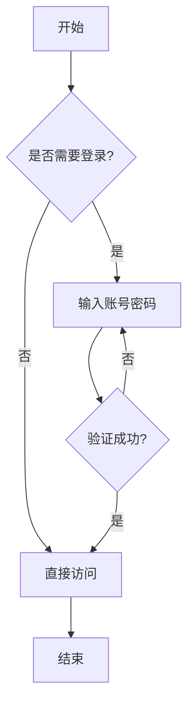
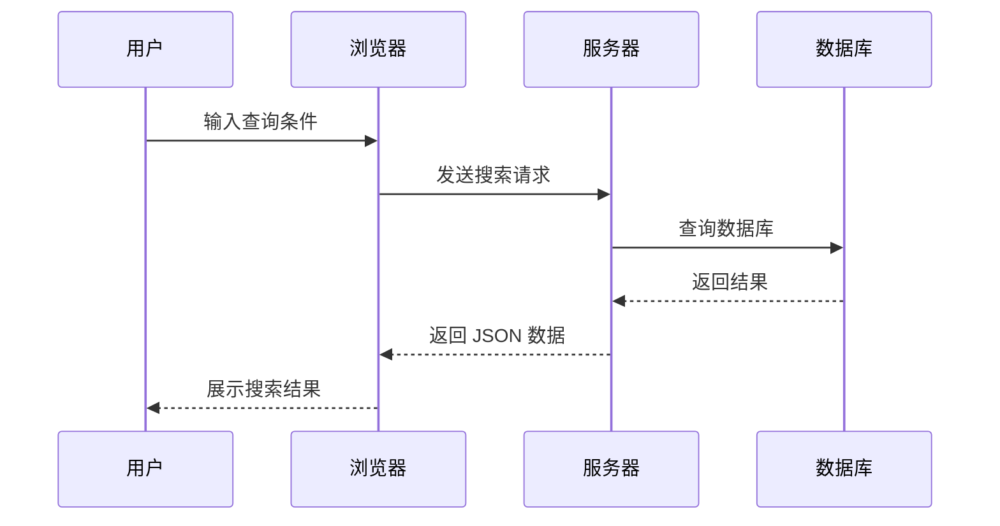
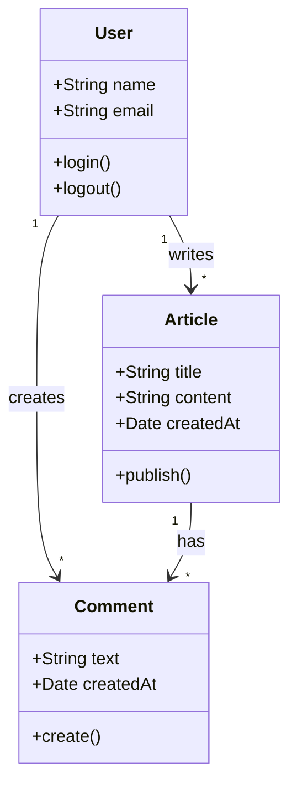
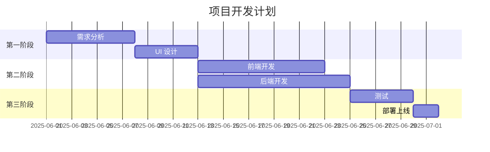
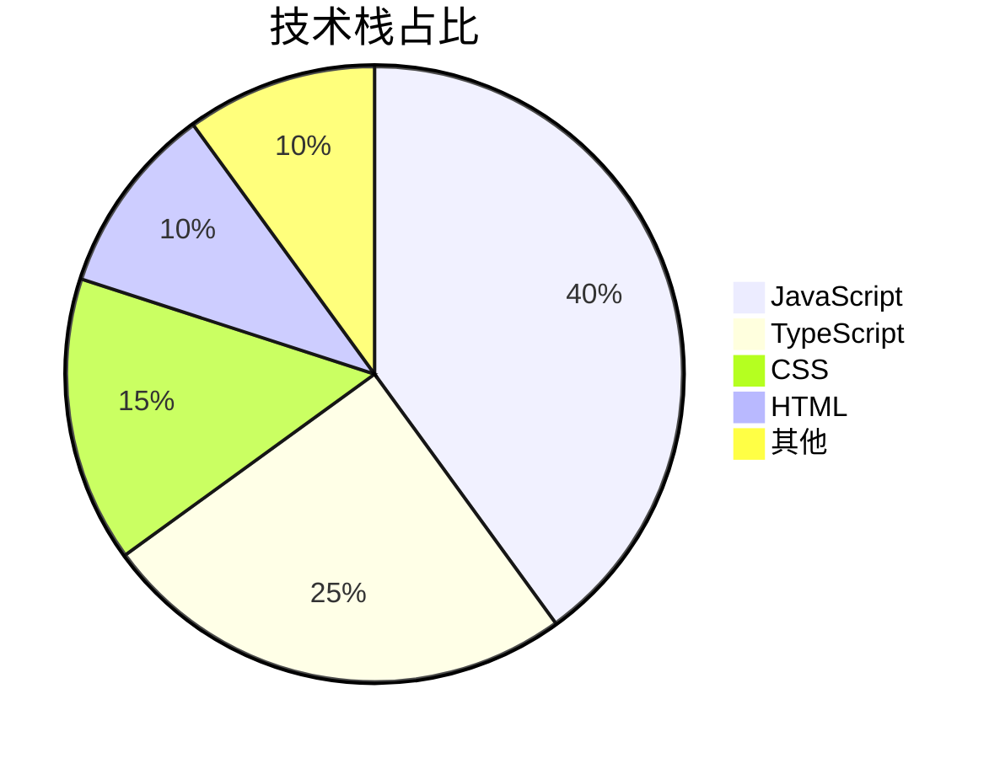
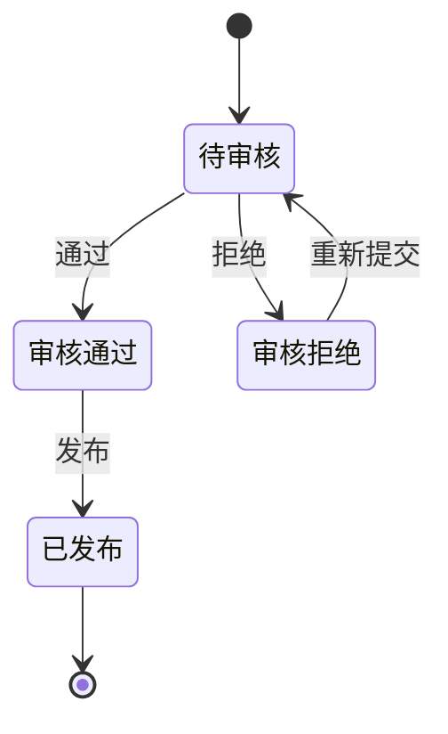
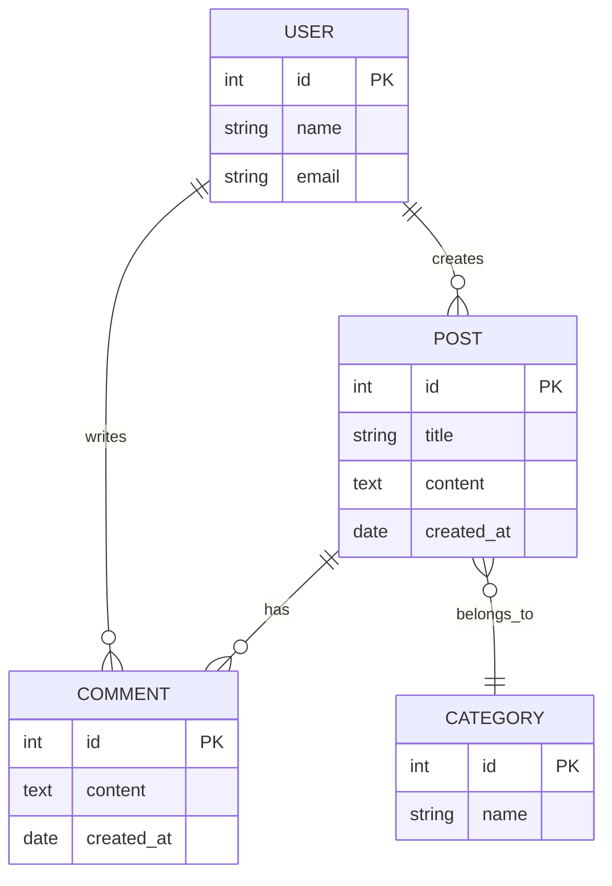

Mermaid 是一个基于 JavaScript 的图表绘制工具，可以通过类似 Markdown 的语法生成各种图表。本篇文章将展示各种 Mermaid 图表的用法。

## 流程图



## 序列图



## 类图



## 甘特图



## 饼图



## 状态图



## ER 图



## 总结

Mermaid 支持多种图表类型：

- **流程图** - 适合展示业务流程和决策逻辑
- **序列图** - 适合展示组件间的交互
- **类图** - 适合展示面向对象的设计
- **甘特图** - 适合项目管理和时间规划
- **饼图** - 适合数据可视化
- **状态图** - 适合展示状态转换
- **ER 图** - 适合数据库设计

在 Markdown 中使用 ` ```mermaid ` 代码块即可，博客会自动渲染为图表。
